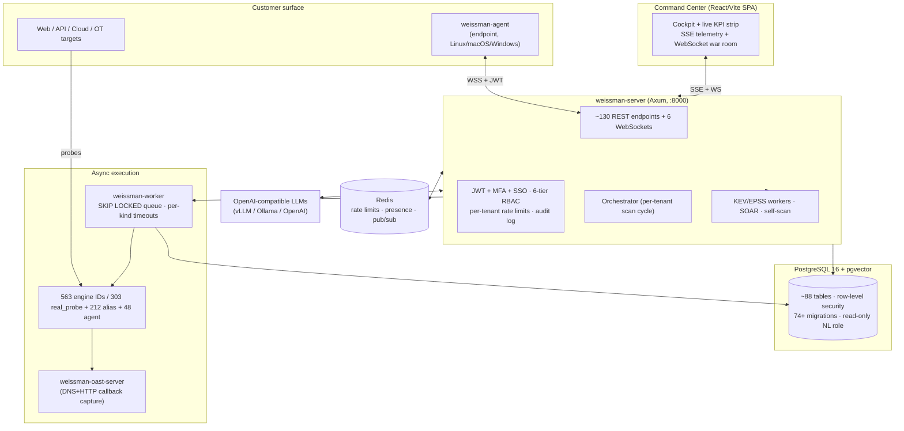

# Weissman Cybersecurity — Company & System Briefing

**An autonomous offensive-security and active-defense platform**

> Prepared from a direct, line-by-line analysis of the production source code (not marketing material).
> Every figure, capability, and control described below is traceable to an implementation in the repository.

| | |
|---|---|
| **Product** | Weissman Cybersecurity Platform |
| **Category** | Autonomous Offensive Security + Active Defense (Continuous Automated Red Teaming, ASM, threat intel, SOAR, EDR/UEBA) |
| **Delivery** | Multi-tenant SaaS + self-hostable; optional cross-platform endpoint agent |
| **Current release** | CalVer `2026.06.2` ("Liminal Boundary Engine") |
| **Core language** | Rust (memory-safe; `unsafe` denied crate-wide) |
| **Footprint** | ~193,000 lines of first-party code across Rust, React, SQL, and Python |
| **License** | Proprietary |

---

## Table of Contents

1. [Executive Summary](#1-executive-summary)
2. [What the Platform Does](#2-what-the-platform-does)
3. [System Architecture](#3-system-architecture)
4. [The Engine System — the Core IP](#4-the-engine-system--the-core-ip)
5. [Detection Integrity & Findings Intelligence](#5-detection-integrity--findings-intelligence)
6. [Threat Intelligence Pipeline](#6-threat-intelligence-pipeline)
7. [Risk Modeling, Attack Paths & Financial Blast Radius](#7-risk-modeling-attack-paths--financial-blast-radius)
8. [The Autonomous AI Layer](#8-the-autonomous-ai-layer)
9. [Orchestration & the Autonomous Pentest Loop](#9-orchestration--the-autonomous-pentest-loop)
10. [Endpoint Agent & UEBA](#10-endpoint-agent--ueba)
11. [Asynchronous Worker & Job System](#11-asynchronous-worker--job-system)
12. [Out-of-Band (OAST) Verification](#12-out-of-band-oast-verification)
13. [SOAR, Playbooks & Alerting](#13-soar-playbooks--alerting)
14. [Deception, Containment & Auto-Healing](#14-deception-containment--auto-healing)
15. [Data Layer: PostgreSQL, Multi-Tenancy & Migrations](#15-data-layer-postgresql-multi-tenancy--migrations)
16. [API Server, Authentication, RBAC & Hardening](#16-api-server-authentication-rbac--hardening)
17. [Observability, High Availability & Backups](#17-observability-high-availability--backups)
18. [The Command Center (Web UI)](#18-the-command-center-web-ui)
19. [Deployment & Infrastructure](#19-deployment--infrastructure)
20. [Engineering Quality & CI/CD Gates](#20-engineering-quality--cicd-gates)
21. [Commercial Layer: Billing, Onboarding & Compliance](#21-commercial-layer-billing-onboarding--compliance)
22. [Safety & Governance Posture](#22-safety--governance-posture)
23. [Technology Stack](#23-technology-stack)
24. [Engineering Scale (by the numbers)](#24-engineering-scale-by-the-numbers)
25. [Honest Status & Roadmap Notes](#25-honest-status--roadmap-notes)
- [Appendix A — Complete Engine Catalog (303 canonical engines)](#appendix-a--complete-engine-catalog-303-canonical-engines)
- [Appendix B — Complete Database Table Inventory (88 tables)](#appendix-b--complete-database-table-inventory-88-tables)
- [Appendix C — Complete API Endpoint Inventory](#appendix-c--complete-api-endpoint-inventory)
- [Appendix D — Complete Command Center Page Inventory](#appendix-d--complete-command-center-page-inventory)

---

## 1. Executive Summary

Weissman Cybersecurity is a **closed-loop, autonomous security platform** that continuously attacks an organization's own attack surface the way a real adversary would, verifies what it finds with live evidence, prices the business risk in dollars, and can automatically defend, contain, and remediate — all under strict, multi-layered safety governance.

It is **not** a vulnerability scanner with a dashboard. It is an integrated system that combines:

- **A very large catalog of security engines** — 563 engine identifiers in the product catalog (303 real_probe / 295 distinct impls, 212 aliases, 48 agent-required), individually-implemented spanning web, API, cloud, network, OT/ICS/IoT, identity, supply chain, AI/LLM, cryptography, OSINT, and host-level detection. **Every engine is wired to a real network/host probe** (HTTP, TCP, UDP, DNS, TLS, or agent telemetry); the codebase explicitly forbids fabricated or randomized findings.
- **An autonomous AI "Supreme Council"** — a multi-model adversarial debate (offensive proposer, blind defensive critic, sovereign decision-maker) with a **vector-database memory of past successes**, human-in-the-loop approval gates, and a cryptographically-signed audit trail.
- **A detection-integrity layer** — stable finding identity, deduplication, clustering, a false-positive feedback loop with Bayesian confidence weighting, and per-finding cryptographic attestation.
- **Live threat intelligence** — local mirrors of CISA KEV and FIRST.org EPSS, enriching every CVE-bearing finding with exploit-probability and known-exploited status at the moment it is persisted.
- **Quantified business risk** — a FAIR-aligned model that converts technical findings into Single- and Annualized-Loss-Expectancy dollar figures, plus graph-based attack-path inference (Dijkstra from internet-exposed assets to "crown jewels").
- **Active defense** — SOAR playbooks, cloud honeytokens/canaries, network containment, and Docker-verified automatic patch generation that opens pull requests.
- **An enterprise control plane** — a ~130-endpoint API with JWT + TOTP MFA + SSO (OIDC/SAML), six-tier RBAC, PostgreSQL row-level multi-tenant isolation, per-tenant rate limiting, and a rich React "Command Center" of ~69 operational pages.

The system is built in **Rust** for memory safety and performance (the entire codebase denies `unsafe` code with a single, documented exception), is delivered as containers / Kubernetes / systemd / Nix, and ships with production observability (Prometheus, OpenTelemetry), leader-elected high availability, and automated backups.

**The single most important architectural commitment is integrity:** findings come from real probes, AI output is gated by human approval and verified out-of-band before it is "learned," and every privileged action is audited. This makes the platform's output defensible — the quality bar one would expect from infrastructure software.

---

## 2. What the Platform Does

At the highest level, the platform runs a continuous, autonomous loop for each customer:

1. **Discover** the customer's true attack surface (domains, subdomains, IPs, ports, cloud assets, SaaS/identity providers, software dependencies) via OSINT and active scanning.
2. **Attack** that surface with hundreds of specialized engines that emulate real adversary techniques — safely and within an approved scope.
3. **Verify** each potential issue with live evidence, including out-of-band callbacks for "blind" vulnerabilities and ephemeral Docker sandboxes for proof-of-exploit.
4. **Enrich & prioritize** every finding with live exploit intelligence (KEV/EPSS), de-duplicate and cluster it, weight it by historical accuracy, and price it in business-loss dollars.
5. **Reason** about the results with a multi-model AI council that proposes, critiques, and decides on attack chains and remediations — under human approval where it matters.
6. **Defend & remediate** automatically: fire SOAR playbooks, deploy deception assets, contain compromised hosts, and open verified remediation pull requests.
7. **Report** to every audience: a live operational Command Center, board-level executive PDFs, and compliance posture against SOC 2 / ISO 27001 / GDPR.

The same platform therefore serves a SOC analyst (triage and hunt), a security engineer (verified findings and auto-remediation), a CISO (risk in dollars and compliance posture), and an MSSP/service provider (multi-tenant operation across many client organizations).

---

## 3. System Architecture

The platform is a Rust **workspace** of nine crates plus a React frontend and a thin legacy Python tooling layer.



**Workspace crates (Rust):**

| Crate | Role |
|---|---|
| `fingerprint_engine` | The heart of the system: ~239 modules — all security engines, orchestration, AI council, persistence, intel, auth, and the HTTP route layer (~78k LOC of `.rs` + ~18k LOC of route handler `.inc` files). |
| `backend/weissman-server` | The production HTTP binary — builds the Axum router, applies the security middleware stack, manages DB pools, and runs startup safety guards. |
| `backend/weissman-core` | Shared models, the authoritative engine ID registry, TLS policy, OpenAPI definitions. |
| `backend/weissman-engines` | Extracted pluggable engine trait (`CyberEngine`) and the OpenAI-compatible LLM client. |
| `crates/weissman-db` | Database access, connection pools, and the custom two-phase migration runner. |
| `crates/weissman-worker` | The standalone asynchronous job consumer. |
| `crates/weissman-agent` | The cross-platform endpoint detection + UEBA agent (single ~5 MB binary). |
| `crates/weissman-oast-server` | A standalone out-of-band (DNS + HTTP) interaction listener for blind-vulnerability verification. |
| `fuzz_core` | Shared fuzzing primitives. |

---

## 4. The Engine System — the Core IP

### 4.1 How engines work

All scanning flows through a single, centralized dispatcher (`engine_dispatch::run_engine`). The design enforces three invariants that are unusual for this category of product:

1. **Single gated entry point.** Every engine call passes through one function that validates the engine is a real production engine, routes agent-required engines to the endpoint agent, and tags every resulting finding with its source engine for full provenance.
2. **Shared, real probe primitives.** A single module (`engine_probes.rs`) provides the only network primitives engines may use: HTTP/1.1 and HTTP/2 clients, raw TCP connect/banner/probe, UDP probes, DNS (A/TXT/MX/CAA), and TLS certificate parsing via OpenSSL. The module header states the contract directly: *every helper performs live network operations; no simulated findings.*
3. **No-signal means no finding.** When an engine observes nothing, it returns zero findings with the message "no live signal observed" — it does not invent a result.

Engines are registered in an authoritative list (`PRODUCTION_ENGINE_IDS`) in `backend/weissman-core`, and a CI script (`verify_engine_wiring.mjs`) **fails the build** if any engine shown in the UI lacks a real execution path. This is how the product keeps its catalog honest.

### 4.2 The catalog (by domain)

The product catalog exposes **500+ engine identifiers** (the frontend registry lists 563, mirrored 1:1 to `PRODUCTION_ENGINE_IDS`). CI-verified classification (`scripts/engine_reality_audit.mjs`): **303 real_probe** (295 distinct implementations — 8 IDs are delegates sharing an impl), **212 aliases** that resolve to a real probe, and **48 agent-required** host-level techniques clearly labeled as such (`info`/advisory when no agent enrolled), 0 no_path. Major domains:

| Domain | Representative engines | What they actually do (from code) |
|---|---|---|
| **Web & API** | BOLA/IDOR, GraphQL deep attack, JWT attacks, OAuth/OIDC, SAML, SSRF (advanced), XXE, SSTI, HTTP request smuggling, cache poisoning, prototype pollution, WebSocket, WAF bypass, CORS misconfig, subdomain takeover, **Liminal Boundary** (HTTP/1 vs HTTP/2 protocol-fracture detector) | Live HTTP probing with payloads, header/JSON analysis, baseline-vs-mutation differentials, GraphQL introspection, cache-oracle headers, metadata-canary SSRF |
| **Cloud** | AWS/Azure/GCP attack, Kubernetes/container, serverless, IaC misconfig, container registry, Cloud Hunter | Metadata-endpoint SSRF, S3/Azure/GCP bucket enumeration, dangling-DNS takeover detection, IAM/K8s exposure probes |
| **Network** | Advanced network (real TCP/UDP), SMB/NetBIOS, IPv6, mTLS/gRPC, BGP/DNS hijacking, timing side-channels | TCP banners, UDP service probes, DNS mail-auth (SPF/DMARC/CAA), host-header rebinding, HTTP timing analysis |
| **OT / ICS / IoT** | Modbus, BACnet, OPC-UA, MQTT, CoAP, SCADA, IoT firmware, BLE/RF | Real industrial-protocol probes (e.g., Modbus FC03 over TCP/502), IoT port and banner fingerprinting |
| **Identity** | Kerberoasting, password spray, identity engine, autonomous privilege escalation | AD port scans, anonymous LDAP bind, multi-role JWT/session replay, HMAC tests |
| **Supply chain** | Supply-chain engine, SBOM analyzer, typosquatting monitor, CI/CD pipeline | Fetches the target's own manifests/SBOMs, parses lockfiles, queries OSV **only for versions actually present** on the target |
| **AI / LLM** | Advanced AI engines, LLM fuzzer, LLM red-team, adversarial ML, generative fuzzing | Live probes of LLM endpoints: jailbreak canaries, plugin manifests, token-exhaustion DoS, prompt-injection |
| **Recon / OSINT** | OSINT, ASM, discovery/spider, auto domain discovery, leak hunter, GitHub secret scan, passive DNS | Certificate-transparency subdomains (crt.sh), port scans, crawling, paste/leak hunting |
| **Cryptography** | PKI/TLS, post-quantum (PQC) scanner, padding-oracle/RSA-timing | TLS certificate inspection, PQC-readiness posture, crypto side-channels |
| **Malware / Stealth / Social** | EDR evasion, anti-forensics, stealth engines, social-engineering surface | Remote heuristics + host-level checks via agent; mail-auth and OAuth discovery (no phishing payloads are ever sent) |
| **APT emulation** | Advanced APT engines, threat emulation (7 named actor personas) | Maps documented actor initial-access surfaces (Exchange OWA, Citrix, exposed RDP/SMB) to live evidence; classifies BLOCKED vs NOT-BLOCKED |
| **Fuzzing** | Feedback fuzzer, eternal fuzz, semantic fuzzer, OOB fuzz | Baseline-vs-mutation anomaly detection with optional LLM-guided mutation and out-of-band confirmation |

### 4.3 Exploit synthesis & verification

For confirmed footholds, the **Proof-of-Exploit (PoE) synthesis engine** (`exploit_synthesis_engine.rs`, the largest single module at ~2,800 lines) runs a disciplined pipeline: baseline fingerprint → NVD CVE correlation → up to 512 concurrent dynamic probes → heuristic triggers (5xx, timeouts, entropy/memory-bleed, timing) → **LLM-synthesized, safety-railed PoC** with self-correction → a layered **verification ladder**:

- an **ephemeral Docker sandbox** (`poc_sandbox.rs`) that re-executes the PoC against the in-scope target with strict resource limits (256 MB RAM, 0.5 CPU), marking it verified only on an out-of-band callback or an expected response marker;
- **OAST callback correlation** for blind classes;
- a **semantic LLM judge** with a minimum confidence threshold.

A separate **"200% verification" sandbox** (`verification_sandbox.rs`) validates *remediations*: it shallow-clones the target repo, spins up a **Bollard-driven Docker container**, confirms the exploit works pre-patch, applies the candidate patch, restarts, and confirms the exploit no longer works — before any pull request is opened.

---

## 5. Detection Integrity & Findings Intelligence

This layer is what separates a credible platform from a noisy scanner. All of it is implemented in code:

- **Stable finding identity.** Each finding's ID is a hash of *invariants only* (engine, target, CVE, CWE, MITRE technique, signature, normalized title) — explicitly excluding timestamps and response bodies — so the same issue re-detected on the next scan is the *same* finding, not a duplicate.
- **True deduplication.** A `UNIQUE(tenant_id, client_id, finding_id)` constraint with `ON CONFLICT DO UPDATE` refreshes evidence and increments a `seen_count` / `last_seen_at`, while **preserving analyst-set status** (acknowledged / fixed / false-positive) across rescans.
- **Clustering.** Findings are clustered by `sha256(target ‖ signature ‖ cwe)` (with URL normalization), aggregating the engines, sources, CVEs, and max severity/CVSS/EPSS that contributed.
- **False-positive feedback loop.** Analyst TP/FP marks feed a Bayesian-shrinkage **confidence multiplier** = `(tp+1)/(tp+fp+1)`, clamped to `[0.1, 1.0]`, applied to risk score at read time. Three false-positive marks on the same `(engine, signature)` **auto-suppress** the next detection — with the audit trail preserved.
- **Cryptographic attestation.** At persist time, each finding receives an HMAC-SHA256 receipt over its immutable fields, so tampering with stored findings is detectable on read.
- **Kill-chain correlation.** Beyond dedup, a correlation-rules engine groups ordered finding stages within a time window into incidents.
- **Default prioritization.** Findings are ordered `KEV → EPSS → CVSS × confidence` — i.e., known-exploited and high-exploit-probability issues surface first, weighted by the engine's historical accuracy.

---

## 6. Threat Intelligence Pipeline

The platform maintains **live local mirrors** of authoritative exploit intelligence and enriches findings automatically:

| Feed | Source | Refresh | Storage |
|---|---|---|---|
| **CISA KEV** (Known Exploited Vulnerabilities) | cisa.gov official JSON feed | every 6 hours | `kev_intel` table |
| **FIRST.org EPSS** (Exploit Prediction Scoring) | api.first.org | every 12 hours + on-demand at persist | `epss_intel` table |
| **NVD CVE** | NIST NVD API 2.0 | cached keyword search | in-memory LRU cache |
| **OSV / GitHub Advisories** | osv.dev, GitHub | cached, batched | LRU + backfill |

Every CVE-bearing finding is enriched at persist time with `epss_score`, `epss_percentile`, `kev_listed`, `kev_known_ransomware`, and `kev_due_date`. A background backfill resolves GHSA/OSV identifiers to CVEs and re-materializes these flags across existing findings. The result: prioritization reflects **what attackers are actually exploiting right now**, not just static CVSS.

---

## 7. Risk Modeling, Attack Paths & Financial Blast Radius

The platform turns thousands of findings into a small number of decisions:

- **Risk graph.** A live graph (`risk_graph_nodes` / `risk_graph_edges`) models assets, identities, networks, packages, repos, cloud resources, and Kubernetes clusters, with edges like *exposes*, *authenticates*, *affects*, *leads_to*. Nodes are scored and **choke points** (high-degree, multi-edge-type nodes) are flagged automatically.
- **Attack-path inference.** A Dijkstra shortest-path search runs from every `internet_exposed` node to every `crown_jewel` node, with edge weights derived from each node's worst CVSS + EPSS×1.5 + KEV×2. It returns the top-K paths (default 25, max 12 hops) and the choke points that appear in ≥50% of them — i.e., *"fix this one node and you break most of the attack paths."* Snapshots are persisted for trend analysis.
- **Financial blast radius (FAIR-aligned).** Findings are priced in dollars:
  - **Single Loss Expectancy:** `SLE = asset_value × clamp(CVSS/10, 0.5, 1.0)`
  - **Annualized Loss Expectancy:** `ALE = SLE × clamp(EPSS×12, 0..12) × discount`, with KEV-listed CVEs flooring the annual rate of occurrence at 1.0/year.
  - Per-client asset-value tag rules let customers map their own asset tags to dollar values. Output rolls up to worst-case SLE, annualized ALE, crown-jewel value, and total asset value per client.
- **Pentest reinforcement memory.** Every confirmed winning payload is embedded as a 1536-dimension vector keyed to the target's fingerprint (server + tech stack) and stored with an HNSW index in pgvector. On the next scan against a *similar* stack, the system retrieves prior wins by approximate-nearest-neighbor search — and tracks replay-hit-rate, so the reinforcement learning is *measurable*.

---

## 8. The Autonomous AI Layer

This is the platform's most differentiated intellectual property: a **stacked decision architecture** that uses multiple LLMs adversarially, remembers what works, and never weaponizes anything without verification and (where it matters) human approval.

### 8.1 The Supreme Council (multi-model adversarial debate)

Implemented in `council.rs` (~1,800 lines), the council pits distinct models against each other in defined roles:

- an **Offensive Proposer** (e.g., a coding-specialized model) proposes structured attack strategies as JSON — not weaponized prose;
- a **Defensive Critic** that is *deliberately blind to the concrete payload* and critiques detection risk and false-positive likelihood;
- a **Sovereign General** with final authority that synthesizes a machine-actionable directive.

The council is **provider-agnostic** — it speaks the OpenAI chat protocol and runs against vLLM, Ollama, OpenAI, or any compatible backend, with per-tenant model selection. Every phase is **HMAC/SHA-256 signed into the audit log** as a `COUNCIL_DEBATE` event. An OAST self-correction loop re-runs the debate (up to a configured number of rounds) when a live probe fails to confirm the strategy.

### 8.2 RAG memory — a closed learning loop

Winning strategies are embedded and stored in `supreme_council_memory` (pgvector, HNSW cosine index). Before each new debate, the system retrieves the top-K most similar prior wins by approximate-nearest-neighbor search and injects them into the proposer's prompt. Critically, **memory is only written after an out-of-band probe confirms success** — the loop learns from verified results, not from the model's own claims. Embedding failures degrade gracefully (no fake vectors).

### 8.3 "Ask Weissman" — natural language to safe SQL

A standout safety design (`nl_query.rs`): users ask questions in natural language; the LLM emits a strict JSON **QueryPlan** — *never raw SQL*. The server validates the plan against an allow-list (6 tables, enumerated columns, 10 operators), compiles it to **parameterized** SQL with `tenant_id` forced into every query, and executes it against a **dedicated read-only PostgreSQL role** (`weissman_ro`) with a 15-second statement timeout. Every question, the compiled SQL, row count, and latency are audited. This makes a natural-language data interface safe enough for production.

### 8.4 Genesis synthesis & the "vaccine vault"

A separate council ("Genesis") validates attack chains *preemptively*: a proposer builds a chain, a critic constrains it, a bypass model tests the constraint, and — if the chain validates — a **vaccine** model produces a remediation patch *and* a detection signature. Validated chains become encrypted entries (AES-256-GCM) in a vault and stream live to a CEO "war room."

### 8.5 Sovereign autonomous subsystems

A family of opt-in (default-off) autonomous loops:

- **Sovereign evolution** — on a probe failure, a critic infers the blocking WAF rule and a hacker model synthesizes a polymorphic bypass; a "shadow preflight" simulates edge responses before any live action.
- **Sovereign C2** — rotates honeytokens and signed port-hop hints for deception assets; can raise a cloud provider's protection level under attack (behind explicit dual-acknowledgment flags).
- **Phantom factory** — generates decoy SSH keys, JWTs, and API configs as trap material.
- **Nexus Sovereign Swarm** — a hyper-scale swarm of up to ~10,000 virtual agents (archetypes: scout, exploiter, correlator, stealth, oracle) that reach multi-agent consensus on findings.

Every one of these is governed by environment flags that default to **off**, and several require explicit dual acknowledgment to take consequential cloud actions.

### 8.6 Predictive & emulation engines

- **Zero-day prediction** — heuristic + fingerprint matching against a curated table of high-risk components and their historical CVE density.
- **Digital twin** — builds an environment profile from live headers; advisory risk scenarios are clearly labeled and off by default.
- **Threat emulation** — runs seven named APT-persona scenarios and reports which were blocked.
- **Deterministic attack-chain planner** — a STRIPS-style planner that derives attack chains **only from observed facts** (it cannot hallucinate capabilities), complementing the LLM narrative planner.

---

## 9. Orchestration & the Autonomous Pentest Loop

A per-tenant orchestrator runs continuous scan cycles (configurable interval) and a strict five-stage pipeline:

| Stage | Name | Activity |
|---|---|---|
| 0 | Global Intel | zero-day radar / threat-intel sweep |
| 1 | Deep Discovery | OSINT + attack-surface mapping, plus LLM-assisted path prediction |
| 2 | Vulnerability Scanning | the full engine suite, scoped to each client's enabled engines |
| 3 | Kill Shot | PoE synthesis — **only if a foothold/finding exists** (gated) |
| 4 | Compliance | audit root hash + report generation |

Engines for each client are the intersection of the client's `enabled_engines` and the tenant's `active_engines`. A shared discovery context feeds tech-stack-specific wordlists (PHP/Django/Spring/Express, etc.) and discovered paths back into the fuzzers. A **global safe mode** widens jitter and inserts inter-engine delays for stealth. The whole loop is wrapped in panic isolation and circuit breakers so a single misbehaving engine cannot crash the system.

---

## 10. Endpoint Agent & UEBA

A single cross-platform Rust binary (`weissman-agent`, ~5 MB) runs on Linux, macOS, and Windows as a service. It enrolls over HTTPS for a per-agent JWT, maintains a **WSS (WebSocket-over-TLS) session** with heartbeats and exponential-backoff reconnect, and holds no persistent local state.

**On-host detections** (~20 advertised capabilities across ~13 implementation modules) include: process-hollowing detection (exe-path-missing heuristic), DLL-hijack / writable-directory execution, process inventory, persistence enumeration (cron / systemd / launchd / scheduled tasks), ARP-table / gateway-MAC spoofing checks, DNS-anomaly / covert-channel heuristics, clipboard exfiltration sampling (size + entropy), EDR/AV presence (18 known products), log-integrity checks, and USB device enumeration.

**UEBA baseline sampler** (`baseline.rs` on the agent, `ueba_detector.rs` on the server): the agent periodically samples open ports, top processes, unique users, load/memory, and failed logins, bucketed by **hour-of-week** (0–167). The server maintains a 7-day rolling baseline per `(agent, metric, hour_of_week)` and fires a **z-score detector**: `|z| > 3` → medium, `|z| > 6` → high, plus categorical detection of never-before-seen ports/processes — but only after a strict learning window (≥24 samples in the bucket), so it doesn't fire prematurely. Samples are retained for 14 days.

---

## 11. Asynchronous Worker & Job System

The `weissman-worker` is a robust distributed job consumer:

- **Dequeue** via PostgreSQL `FOR UPDATE SKIP LOCKED`, backed by a partial index `(created_at, kind) WHERE status='pending'` that turned a multi-second hot query into a few-millisecond index scan.
- **Leasing & heartbeats** — a 300-second lock extended every 30 seconds; stale jobs are reclaimed.
- **Separate concurrency lanes** — light (default 8) and heavy (default 2) semaphores; a pool role can restrict a worker to research vs. client jobs.
- **Per-kind timeouts** — from 30 s (`ping`) to 60 min (`tenant_full_scan`), with ~27 distinct job kinds (full scans, council debates, deep fuzz, PoE synthesis, auto-heal, threat-intel runs, cloud scans, deception deploys, and more).
- **Panic isolation & dead-lettering** — each job runs on its own task with abort-on-timeout and exponential-backoff retry to a dead-letter state.

---

## 12. Out-of-Band (OAST) Verification

For "blind" vulnerability classes (blind SSRF/XXE, Log4Shell-style JNDI, out-of-band injection), the platform runs a **standalone OAST server** (`weissman-oast-server`) that listens on both **HTTP and DNS**, captures interactions keyed by a unique token, and records source IP, method, path, headers, and DNS query details to the database. Engines embed per-scan tokens into payloads; the fuzzer then polls the listener to confirm a real callback occurred before marking a finding verified. This is the difference between "we sent a payload" and "we proved the target reached out to us."

---

## 13. SOAR, Playbooks & Alerting

**SOAR playbooks** (`soar_playbook.rs`) use a JSON DSL:

```
when { severity, kev, epss_min, exposed, engines, cve_prefixes, cooldown_seconds }
do   [ ...actions ]
```

Seven action types are implemented: `set_status`, `slack_notify`, `webhook`, `http_post`, `open_pr` (queues a verified auto-heal job), `isolate_host`, and `page_oncall`. Dispatch is **idempotent** (a SHA-256 dedup key with a cooldown window) and fully audited. Every newly persisted finding is evaluated against enabled playbooks automatically. A visual **PlaybookBuilder** in the UI provides dry-run testing.

**Alert rules** are a separate, simpler mechanism with its own evaluator (polls recent findings every 60 s) and five delivery channels: webhook, Slack, Microsoft Teams, PagerDuty, and email (SMTP) — with per-finding fire deduplication.

---

## 14. Deception, Containment & Auto-Healing

**Deception / active defense:**
- Dynamically generated **honeytokens** (AWS keys, DB creds, API keys, shadow endpoints) with no hardcoded secrets.
- **Real AWS canaries** — creates an IAM user with a deny-all policy and an access key, plants decoy artifacts in the customer's S3 / SSM Parameter Store via cross-account assume-role, and monitors via an OAST URL and a signed EventBridge webhook; any use of the canary key raises an alert.
- **Cloudflare blackholing** — optional blocking of an attacker's ASN or /24 on a canary hit (behind dual-acknowledgment flags).

**Containment** (`cloud_containment_engine.rs`): EC2 quarantine (new forensic-only security group) and Kubernetes deny-by-default NetworkPolicy.

**Auto-healing:** the SOAR `open_pr` action queues a job that applies a candidate patch, **verifies it in an ephemeral Docker container** (exploit works before, fails after), and opens a GitHub branch + pull request — clearing the git token after completion.

---

## 15. Data Layer: PostgreSQL, Multi-Tenancy & Migrations

- **PostgreSQL 16 + pgvector** (the vector extension powers the AI memory and pentest reinforcement). ~88 application tables across a tenant-scoped public schema, a global `intel` schema, and the EPSS/KEV mirrors; defined by **74+ SQL migrations** (~4,000 lines).
- **Multi-tenant isolation via Row-Level Security.** Every tenant table has `ENABLE` + `FORCE ROW LEVEL SECURITY` policies keyed on a transaction-local `app.current_tenant_id` GUC. The application role is subject to RLS; a separate auth role with `BYPASSRLS` is narrowly scoped to login lookups and is itself audited (with auto-revocation on suspicious cross-tenant access).
- **Three database roles:** `weissman_app` (RLS-enforced), `weissman_auth` (login only), and `weissman_ro` (the read-only role for the natural-language query interface, restricted to a tightly-scoped table whitelist with its own statement timeout and memory limits).
- **A custom two-phase migration runner** (`no_tx_migrations.rs`) that detects a `-- weissman:no-transaction` header and runs `CREATE INDEX CONCURRENTLY`-style migrations **outside any transaction**, recording them in `_sqlx_migrations` with SQLx-compatible SHA-384 checksums so the standard runner safely skips them. Deferred dependencies are re-applied after their tables exist. (This is a genuinely hard problem solved cleanly.)

---

## 16. API Server, Authentication, RBAC & Hardening

**The API** (`weissman-server`, Axum on `:8000`) exposes ~100 route registrations / ~130 method-path endpoints (implemented across ~271 handler functions) plus six WebSocket channels, with an OpenAPI 3.1 spec and Swagger UI.

**Authentication (layered):**
- **JWT** access tokens (HS256, default 15-min TTL, with a mandatory `jti` for revocation), delivered via HttpOnly `Secure` cookie or `Authorization: Bearer`.
- **Refresh tokens** stored only as SHA-256 hashes, rotated on use, with a `Strict`-SameSite cookie scoped to `/api/auth`.
- **TOTP MFA** (setup/enable/verify/disable), with tenant-level enforcement that returns `403 mfa_enrollment_required` when policy requires it.
- **SSO** via **OIDC** (PKCE + nonce, JIT user provisioning) and **SAML** (production requires `xmlsec1` signature verification).
- **Token revocation** — both access (`jti` denylist) and refresh, with live RBAC re-validation on every authenticated request.

**RBAC** — a six-tier ranked model: `viewer < analyst < operator < admin < ceo`, plus a `superadmin` flag that bypasses role checks, and a separate `agent` identity. Authorization is enforced in five layers: the auth guard, a mutation-RBAC middleware (writes only), a dedicated CEO middleware, ~63 explicit per-handler checks, and finally PostgreSQL RLS. Scope is also enforced: a scan target must resolve to an approved domain/IP for the client or it is rejected with `403`, with private/reserved IPs blocked and the resolved host/IP pinned and re-validated at execution time.

**Hardening** (much of it enforced at startup — the server *refuses to boot* in production if violated):
- Full security-header suite (HSTS, strict CSP, `X-Frame-Options: DENY`, `nosniff`, Referrer-Policy, Permissions-Policy).
- TLS policy that refuses insecure TLS in production and forces `Secure` cookies.
- Startup guards that reject weak/default JWT secrets, default admin passwords, insecure SAML skip-verify, default DB passwords, missing metrics tokens, and (unless single-node is explicitly allowed) a missing Redis.
- **Four tiers of rate limiting** (edge-by-IP, API-by-IP, login/enroll, and scan-by-tenant), Redis-backed when available; account lockout after 10 failures.
- **Constant-time comparisons** (`subtle`) for destructive-action confirmation and webhook verification.
- SSRF protection on outbound requests, append-only audit logging, panic shields with per-label circuit breakers, and configurable data-retention purges.

---

## 17. Observability, High Availability & Backups

- **Prometheus metrics** at `/api/metrics` (token-protected): HTTP latency histograms and counts, DB pool gauges, pending-job and active-scan-cycle gauges, and backup success/failure counters.
- **OpenTelemetry / OTLP** distributed tracing with optional JSON structured logs; a trace ID is propagated from HTTP requests through to async jobs.
- **SSE telemetry bus** with cross-replica fan-out via Redis pub/sub powering the live Command Center.
- **Leader election** via a PostgreSQL advisory lock ensures singletons (orchestrator scans, backups, schedulers, intel refresh) run on exactly one node — failing *closed* in production.
- **Automated `pg_dump` backups** with gzip, retention policy, and Prometheus-exported success timestamps, gated to the leader node.

---

## 18. The Command Center (Web UI)

A React 18 / Vite single-page application of **~69 pages** with lazy-loaded route chunks, internationalization (i18next), and rich data-visualization (recharts, three.js globe, `@xyflow/react` graphs, framer-motion, TanStack Table). Highlights:

- A **Cockpit** with a sticky, "Bloomberg-style" executive KPI strip (security score, open findings by severity with 24-hour deltas, MTTR, asset counts, job queue, agent fleet status) refreshed every 15 seconds, plus a live activity feed over Server-Sent Events.
- A **3D Intel Map** (WebSocket-fed globe with threat arcs, kill-chain, radar) and a cinematic **War Room**.
- Operational surfaces: **FindingsCommandCenter** (filterable table + drawer + CSV export), **RiskGraphVisualization** (interactive attack-path graph), **KillChainOrchestrator**, **ThreatHuntingWorkbench**, **PlaybookBuilder**, **AskWeissman** (NL→SQL chat), **RemediationHub** (Kanban from live findings), **AgentManagement**, **ComplianceFrameworks**, **CloudControlTower**, **SupplyChainHub**, **OT/ICS**, **MobileSecurity**, **PQC Radar**, and more.
- A **CEO Command Center** with the genesis war room, vaccine vault, sovereign lab, god-mode engine matrix, and live council streams — behind a dedicated protected route and the CEO RBAC middleware.

---

## 19. Deployment & Infrastructure

Multiple first-class deployment paths, all from the same artifacts:

- **Docker Compose** — an nginx gateway (serving the SPA, the marketing site, and proxying `/api` + `/ws`), the backend, the worker, PostgreSQL (pgvector), and Redis; with an optional monitoring profile (Prometheus + Grafana + Alertmanager).
- **Kubernetes** (`deploy/k8s/`) — backend (2 replicas with health probes), worker, nginx gateway (2 replicas), Redis, services, ingress (`weissmancyber.com`), and a configmap; PostgreSQL is assumed managed/external.
- **systemd** (`deploy/systemd/`) — a `weissman.target` wanting the server and worker units, with an install helper; the UI is built into the binary's static directory (no Node.js in production).
- **Nix / NixOS** (`flake.nix`, `nix/nixos-modules/`) — reproducible builds (Crane + Fenix) with a dedicated `release-nix` profile and modules for the bot, a vLLM service, and HPC tuning.

The Rust release profile is tuned for production (fat LTO, single codegen unit, symbols stripped), and a NUMA-aware runtime can pin scan threads on Linux.

---

## 20. Engineering Quality & CI/CD Gates

CI (`.github/workflows/`) enforces a serious quality bar on every change:

- **Rust:** `cargo fmt --check`, Clippy (`-D correctness -D suspicious`, with pedantic warnings), `cargo test --workspace`, and `cargo audit` (dependency vulnerabilities).
- **Migration sync:** a script guarantees the two migration directories stay identical.
- **Security scanning:** gitleaks (secrets), Trivy (filesystem + container images), `npm audit`, Semgrep (SAST, report-only), and CodeQL (JS/TS + Python, weekly).
- **Python:** `pip-audit` + `ruff` + conditional `pytest`.
- **Frontend:** ESLint, Vitest, and a production build.
- **Engine wiring + smoke:** the `verify_engine_wiring.mjs` gate (UI engines must have real execution paths), a Docker build of every image, a live server+worker brought up against real PostgreSQL + Redis, a **cross-tenant RLS isolation test**, and engine-group smoke checks.

The Rust crate **denies `unsafe` code** across the board, with one documented exception (NUMA CPU pinning) carrying explicit safety invariants — a strong, auditable memory-safety posture.

---

## 21. Commercial Layer: Billing, Onboarding & Compliance

- **Self-serve onboarding** via two paths: email-verification signup (creates tenant + admin + starter subscription) and immediate B2B registration — both transactional, both gated behind production flags.
- **Billing via Paddle** (migrated off Stripe): plans (starter / professional / enterprise) with client and monthly-scan quotas, subscription and usage-counter tables, signed webhooks, and enforcement at the client-create and scan-enqueue boundaries.
- **Compliance** mapping of live findings to **SOC 2, ISO 27001, and GDPR** controls, with posture percentages, per-control status, and downloadable framework audit PDFs.
- **Reporting:** enterprise client PDFs (cover, risk gauge, charts, remediation roadmap, technical detail, cryptographic seal + QR), board-level executive PDFs with compliance percentages, and bug-bounty-style Markdown reports.

---

## 22. Safety & Governance Posture

Because the platform performs *offensive* actions, safety is engineered as a first-class concern, not an afterthought. The controls below are all implemented:

1. **Scope enforcement** — every target must be in an approved scope; out-of-scope → `403`; private/metadata IPs blocked; scope re-validated at execution.
2. **Human-in-the-loop** — weaponized council output requires explicit operator approval; payload previews are sanitized (shell keywords redacted); approved jobs run with a non-negotiable "no shells" safety rail.
3. **Verify-before-learn** — AI strategies are only written to memory after out-of-band confirmation.
4. **NL→SQL safety** — allow-listed plan, parameterized SQL, read-only role, forced tenant scoping, statement timeout.
5. **Default-off autonomy** — all "sovereign" loops are disabled unless explicitly enabled; consequential cloud actions require dual acknowledgment; a global kill switch and safe mode exist.
6. **Auditability** — every authenticated action, every council phase (HMAC-signed), and every natural-language query (with compiled SQL) is logged.
7. **Tenant isolation** — enforced at the database via forced RLS, tested in CI.
8. **Memory safety** — Rust with `unsafe` denied; panic isolation and circuit breakers prevent cascading failures.
9. **AI quota** — AI-heavy scans are rate-limited per tenant.
10. **Proof, not assertion** — findings require live probes; PoCs require sandbox/OAST verification; remediations require pre/post Docker validation.

---

## 23. Technology Stack

| Layer | Technologies |
|---|---|
| **Core services** | Rust (edition 2021, toolchain 1.91.1), Tokio async runtime, Axum, Tower/Tower-HTTP, SQLx |
| **Database** | PostgreSQL 16 + pgvector (HNSW vector indexes), Redis |
| **AI/LLM** | OpenAI-compatible chat + embeddings (vLLM, Ollama, OpenAI); 1536-dim vector memory |
| **Crypto** | OpenSSL, bcrypt, JWT (HS256), AES-256-GCM, HMAC-SHA256/384, ML-KEM (post-quantum), Ed25519 |
| **Cloud SDKs** | AWS SDK (IAM, STS, S3, EC2, SSM), Cloudflare API, Kubernetes API |
| **Frontend** | React 18, Vite, react-router, recharts, three.js, @xyflow/react, framer-motion, i18next, TanStack Table |
| **Observability** | Prometheus (metrics-exporter), OpenTelemetry/OTLP, structured tracing |
| **Packaging / Deploy** | Docker, Docker Compose, Kubernetes, systemd, Nix/NixOS |
| **CI/CD** | GitHub Actions, Clippy, cargo-audit, gitleaks, Trivy, Semgrep, CodeQL, ESLint, Vitest, Playwright |
| **Legacy tooling** | Python (intel feeds, correlation utilities; superseded by Rust for all production execution) |

---

## 24. Engineering Scale (by the numbers)

| Metric | Value |
|---|---|
| Total first-party code | **~193,000 lines** |
| Rust source (`.rs`) | **~99,700 lines** |
| Rust route-handler includes (`.inc`) | **~17,800 lines** |
| Rust modules in the core engine crate | **239 files** |
| Frontend (React/JSX) | **~54,500 lines**, **69 pages** |
| SQL migrations | **75 files**, ~4,076 lines, **88 `CREATE TABLE`s** |
| Legacy Python | **~17,000 lines** |
| Workspace crates | **9** Rust crates |
| Engine catalog | **563 engine IDs** → **303 real_probe** (295 distinct impls) + **212 alias** + **48 agent_required**, 0 no_path |
| API surface | **~130 endpoints**, ~271 handlers, **6 WebSocket channels** |
| Database | **~88 tables**, full row-level security, 3 scoped DB roles |
| Async job kinds | **~27** |
| Agent detections | **~20 capabilities** across 13 modules + UEBA baseline |
| Threat-intel feeds | **4** (KEV, EPSS, NVD, OSV/GitHub) |
| Compliance frameworks | **3** (SOC 2, ISO 27001, GDPR) |
| Memory safety | `unsafe` **denied** crate-wide (1 documented exception) |

---

## 25. Honest Status & Roadmap Notes

In the spirit of a precise, code-grounded briefing, the following nuances are stated plainly (and reflect well on the team's discipline):

- **Engine count is presented honestly in the code itself.** The product surfaces 500+ engine identifiers, but the codebase distinguishes ~303 canonical implementations from vertical/marketing aliases via an explicit accounting module — and a CI gate prevents any UI engine from lacking a real execution path. The platform deliberately avoids inflated "no-op" engines.
- **Agent detections are pragmatic.** Of the ~20 advertised agent capabilities, several are aliases over shared host-inspection code, and UEBA's richest metrics are Linux-first (other OSes degrade gracefully). One detection (timestomp) exists as a stub and is not yet wired.
- **Autonomy ships safe-by-default.** The most powerful "sovereign" features are disabled unless explicitly enabled, and the consequential cloud actions require dual acknowledgment. This is a deliberate safety choice, not a missing feature.
- **The platform is a Rust rewrite of an earlier Python system.** A legacy Python layer remains in the repository for intel feeds and correlation tooling, but **all production execution — API, orchestration, engines, worker — is Rust.** The old Alembic schema is explicitly deprecated in favor of the SQLx migrations.
- **Monitoring dashboards are catching up to renamed metrics.** The Prometheus alert rules track the current metric names; a Grafana dashboard still references some legacy names — a cosmetic alignment item.

---

## Appendix A — Complete Engine Catalog (303 canonical engines)

The complete, ordered registry of canonical engine implementations (`FULL_ENGINE_REGISTRY_ORDER` in `backend/weissman-core/src/models/engine.rs`), grouped by domain. These are in addition to 212 catalog/vertical aliases that resolve to these implementations, for the 563 identifiers shown in the product.

**Recon, OSINT & Attack-Surface Intelligence:** `osint`, `asm`, `leak_hunter`, `discovery_engine`, `recon`, `satellite_recon`, `darkweb_intel`, `financial_osint`, `blockchain_trace`, `metadata_harvest`, `patent_recon`, `telecom_osint`, `iot_shodan_scan`, `job_posting_osint`, `github_secret_scan`, `dark_web_monitor`, `passive_dns_forensics`, `threat_intel_fusion`, `attack_surface_quantify`, `adversarial_simulation`

**Web & API Attacks:** `bola_idor`, `graphql_attack`, `jwt_attack`, `oauth_oidc`, `http_smuggling`, `liminal_boundary`, `prototype_pollution`, `ssrf_advanced`, `xxe`, `ssti`, `file_upload`, `websocket_attack`, `cache_poisoning`, `graphql_deep_attack`, `grpc_reflection_attack`, `http2_attack`, `swagger_abuse`, `soap_injection`, `odata_injection`, `css_injection`, `template_injection_adv`, `http_parameter_pollution`, `api_mass_assignment`, `web_cache_poison_adv`, `clickjacking_engine`, `subdomain_takeover`, `file_inclusion_rfi`, `deserialization_net`, `nosql_deep_injection`, `jwt_advanced_attack`, `api_rate_limit_bypass`, `idor_advanced`, `graphql_subscription_attack`, `webrtc_attack`, `web3_dapp_attack`, `api_gateway_bypass`

**AI / LLM Security:** `llm_path_fuzz`, `semantic_ai_fuzz`, `ai_adversarial_redteam`, `llm_redteam`, `adversarial_ml`, `autonomous_pentest`, `nexus_sovereign_swarm`, `prompt_injection_chain`, `model_inversion_attack`, `ai_supply_chain_attack`, `rag_poisoning_engine`, `adversarial_examples`, `data_poisoning_engine`, `deepfake_synthesis`, `llm_dos_attack`, `gpt_plugin_attack`, `autonomous_ai_escape`, `llm_memory_extraction`, `neural_backdoor_detect`, `federated_learning_attack`, `llm_red_team_advanced`, `model_stealing_engine`, `quantum_sovereign_nexus`

**Cloud & Container Security:** `aws_attack`, `azure_attack`, `gcp_attack`, `k8s_container`, `iac_misconfig`, `serverless_attack`, `cloud_metadata_ssrf`, `s3_bucket_attack`, `lambda_escape`, `cloud_iam_escalation`, `kubernetes_rbac_escape`, `azure_devops_attack`, `gcp_privilege_attack`, `terraform_state_attack`, `cloudformation_injection`, `service_mesh_attack`, `cloud_audit_evasion`, `ecr_registry_attack`, `cloud_worm_propagation`, `serverless_injection`, `cloud_data_exfil`, `eks_attack`, `cloud_network_attack`, `secrets_manager_attack`, `cloud_privilege_persistence`

**OT / ICS / IoT:** `scada_ics`, `iot_firmware`, `ble_rf`, `modbus_attack`, `mqtt_attack`, `coap_attack`, `opcua_attack`, `modbus_exploit`, `plc_logic_bomb`, `lorawan_attack`, `voltage_glitch_attack`, `tpm_firmware_attack`, `cold_boot_attack`, `hospital_hl7_attack`, `plc_logic_attack`, `hmi_attack`, `satellite_comm_attack`, `firmware_emulation_attack`, `profinet_attack`, `rfid_nfc_attack`, `industrial_protocol_fuzz`, `can_bus_surface`

**Stealth, Evasion & Malware:** `edr_evasion`, `waf_bypass`, `timing_sidechannel`, `antiforensics`, `stealth_engine`, `dll_hijacking_engine`, `sandbox_evasion`, `rootkit_simulation`, `memory_forensics_evasion`, `av_bypass_engine`, `dns_tunneling_c2`, `steganography_c2`, `https_c2_masquerade`, `icmp_covert`, `rop_chain_engine`, `timing_evasion_engine`, `log_tampering_engine`, `jit_spray`, `com_hijacking`, `network_traffic_masking`, `anti_debug_evasion`, `parent_pid_spoof`, `bootkit_uefi`, `fileless_malware_engine`, `polymorphic_engine`, `botnet_c2_engine`, `keylogger_engine`, `spyware_stalkerware`, `worm_propagation`, `rce_exploit_engine`, `persistence_mechanism`, `lateral_movement_engine`, `data_staging_engine`, `exploit_kit_engine`, `trojan_dropper`, `macro_malware`

**Cryptography & Identity:** `pki_tls`, `pqc_scanner`, `password_spray`, `kerberoasting`, `saml_attack`, `crypto_engine`, `padding_oracle_attack`, `hash_extension_attack`, `ecdsa_nonce_bias`, `rsa_timing_attack`, `mfa_bypass_engine`, `kerberos_attack_suite`, `pki_hierarchy_attack`, `session_fixation_adv`, `password_hash_crack`, `oauth_advanced_attack`, `saml_advanced_attack`, `quantum_key_attack`, `password_spray_advanced`

**Network & Protocol:** `bgp_dns_hijacking`, `ipv6_attack`, `mtls_grpc`, `smb_netbios`, `arp_spoofing_engine`, `vlan_hopping_attack`, `dhcp_attack_engine`, `dns_cache_poisoning`, `dns_rebinding`, `snmp_exploitation`, `rdp_attack_engine`, `ldap_injection_engine`, `ss7_attack_simulation`, `wifi_attack_engine`, `bluetooth_attack_engine`, `ospf_bgp_hijack`, `mpls_vpn_attack`, `lte_5g_attack`, `ipv6_advanced_attack`, `network_covert_channel`, `wpa3_attack_engine`, `tor_exit_attack`, `protocol_downgrade`, `packet_injection_engine`, `network_tap_advanced`, `multicast_attack`, `nat_traversal_attack`, `network_baseline_anomaly`

**Supply Chain & CI/CD:** `supply_chain`, `cicd_pipeline`, `container_registry`, `sbom_analyzer`, `typosquatting_monitor`, `npm_package_attack`, `pypi_supply_chain`, `github_actions_attack`, `docker_image_poison`, `maven_supply_chain`, `compiler_backdoor`, `cdn_poisoning_engine`, `software_signing_attack`, `build_system_compromise`, `update_hijacking`, `sbom_forgery_engine`, `third_party_api_attack`, `iac_supply_chain`

**APT / Threat-Actor Emulation:** `apt28_techniques`, `apt29_techniques`, `apt41_techniques`, `lazarus_group_ttps`, `volt_typhoon_ttps`, `scattered_spider_ttps`, `salt_typhoon_ttps`, `fin7_techniques`, `conti_ransomware_ttps`, `lockbit_techniques`, `cl0p_techniques`, `blackcat_alphv_ttps`, `midnight_blizzard_ttps`, `earth_longzhi_ttps`, `equation_group_ttps`, `sandworm_techniques`, `carbon_spider_ttps`, `wizard_spider_ttps`, `unc2452_ttps`, `unc3944_ttps`

**Social Engineering (surface analysis only — no live phishing payloads sent):** `spear_phishing_engine`, `vishing_engine`, `smishing_engine`, `qr_phishing`, `deepfake_voice_engine`, `business_email_compromise`, `watering_hole_attack`, `pretexting_engine`, `insider_threat_engine`, `brand_impersonation`, `fake_update_engine`, `linkedin_phishing`, `callback_phishing`, `physical_social_eng`, `typosquatting_phishing`

**Mobile Security:** `android_malware_engine`, `ios_exploit_engine`, `mobile_mitm`, `ssl_pinning_bypass`, `android_intent_attack`, `ios_url_scheme_attack`, `mobile_overlay_attack`, `sim_swap_engine`, `mobile_banking_trojan`, `app_store_attack`, `mdm_bypass_engine`, `bluetooth_mobile_attack`, `nfc_relay_attack`, `mobile_spyware_engine`, `react_native_attack`

**Data Exfiltration & Covert Channels:** `dns_exfil_engine`, `http_covert_exfil`, `cloud_exfil_engine`, `encrypted_exfil`, `acoustic_exfil`, `em_exfil_engine`, `optical_exfil`, `cache_timing_exfil`, `keyboard_acoustic`, `screen_capture_exfil`, `clipboard_hijack`, `database_exfil`, `email_exfil`, `insider_exfil`, `storage_covert_channel`

**Verification, Deception & Prediction (Top-Tier):** `kill_chain`, `oast_oob`, `deception_honeypot`, `digital_twin`, `zero_day_prediction`, `threat_emulation`, `poe_synthesis`

> Engines whose techniques are host-level (process injection, USB, ARP, Wi-Fi/Bluetooth radio, acoustic/EM/optical exfiltration, physical/bus attacks, etc.) are executed by the endpoint agent or clearly labeled `info`/`agent_required` when no remote signal exists — never reported as confirmed remote vulnerabilities.

---

## Appendix B — Complete Database Table Inventory (88 tables)

All 88 application tables defined by the SQL migrations, grouped by function.

- **Tenancy & clients:** `tenants`, `clients`, `system_configs`, `engagements`, `pending_signups`
- **Users & authentication:** `users`, `tenant_idps`, `user_refresh_tokens`, `weissman_revoked_tokens`, `security_events`
- **Findings & detection intelligence:** `vulnerabilities`, `report_runs`, `weissman_finding_clusters`, `engine_confidence_adjustments`, `finding_suppressions`, `weissman_correlation_incidents`
- **Risk graph & attack surface:** `risk_graph_nodes`, `risk_graph_edges`, `asm_graph_nodes`, `asm_graph_edges`, `aws_assets`, `k8s_assets`, `ot_ics_fingerprints`, `attack_path_snapshots`, `attack_chain`
- **Threat intelligence:** `kev_intel`, `epss_intel`, `threat_ingest_events`, `dynamic_payloads`, `ephemeral_payloads`
- **Async jobs & pipeline:** `weissman_async_jobs`, `pipeline_run_state`, `poe_jobs`
- **Endpoint agents & UEBA:** `endpoint_agents`, `endpoint_agent_enrollment_tokens`, `endpoint_agent_tasks`, `endpoint_agent_enroll_attempts`, `agent_metric_samples`, `agent_metric_baselines`, `agent_anomalies`
- **SOAR, alerts, containment & auto-heal:** `weissman_playbooks`, `weissman_playbook_runs`, `weissman_alert_rules`, `weissman_alert_rule_fires`, `soc_incident_playbook_steps`, `containment_rules`, `auto_heal_job_specs`, `heal_requests`, `heal_verification_steps`
- **AI council, sovereign & CEO:** `supreme_council_memory`, `supreme_council_rag_hits`, `council_hitl_queue`, `pentest_winning_paths`, `sovereign_learning_buffer`, `genesis_vaccine_vault`, `genesis_suspended_graphs`, `ceo_war_room_events`, `ceo_hpc_policy`, `swarm_events`, `edge_swarm_nodes`
- **Deception / active defense:** `deception_assets`, `deception_triggers`, `deception_cloud_deployments`
- **Fuzzing telemetry:** `generative_fuzz_winning_payloads`, `semantic_fuzz_log`, `llm_fuzz_events`
- **Identity analytics:** `identity_contexts`, `privilege_escalation_events`
- **Compliance, evidence & engagements:** `compliance_mappings`, `evidence_items`, `roe_override_requests`, `client_sbom_components`, `cloud_scan_findings`, `cicd_scan_events`
- **Financial risk:** `client_asset_value_rules`, `client_financial_risk_snapshots`
- **Billing:** `billing_plans`, `tenant_subscriptions`, `tenant_usage_counters`, `tenant_stripe_customers`, `stripe_webhook_events`
- **Scheduling:** `weissman_scan_schedules`
- **Audit & observability:** `audit_logs`, `nl_query_audit`, `tenant_llm_usage`, `runtime_traces`
- **Out-of-band verification:** `oast_interaction_hits`, `oast_probe_tokens`

Every tenant-scoped table above is protected by forced PostgreSQL Row-Level Security. The global intel mirrors (`kev_intel`, `epss_intel`), the cross-tenant worker queue (`weissman_async_jobs`), and the `intel`-schema payload tables are deliberately exempt.

---

## Appendix C — Complete API Endpoint Inventory

All route registrations in the HTTP layer (`fingerprint_engine/src/http/serve.rs`), grouped by function. Most paths support multiple HTTP methods (GET/POST/PATCH/DELETE).

- **Authentication & session:** `/api/login`, `/api/logout`, `/api/auth/me`, `/api/auth/refresh`, `/api/auth/sse-ticket`, `/api/auth/signup`, `/api/auth/verify`, `/api/auth/mfa/setup`, `/api/auth/mfa/enable`, `/api/auth/mfa/verify`, `/api/auth/mfa/disable`, `/api/auth/mfa/status`, `/api/auth/oidc/begin`, `/api/auth/saml/begin`, `/api/auth/saml/acs`
- **Onboarding & billing:** `/api/onboarding/register`, `/api/onboarding/target`, `/api/billing/usage`, `/api/billing/sync-paddle`, `/api/webhooks/paddle`
- **Clients & scope:** `/api/clients/:id/findings`, `/api/clients/:id/report/pdf`, `/api/clients/:id/export/csv`, `/api/clients/:id/deception`, `/api/clients/:id/auto-heal`, `/api/clients/:id/sbom/export`, `/api/clients/:id/swarm/run`, `/api/clients/:id/llm-fuzz/run`, `/api/clients/:id/llm-fuzz/events`
- **Findings & detection intel:** `/api/findings`, `/api/findings/clusters`, `/api/findings/export/csv`, `/api/export/findings`, `/api/intel/status`, `/api/intel/suppressions`
- **Scans, jobs & pipeline:** `/api/scan/start`, `/api/scan/stop`, `/api/scan/status`, `/api/scan/all-engines`, `/api/scan/run-all`, `/api/command-center/scan`, `/api/command-center/deep-fuzz`, `/api/command-center/ticker`, `/api/pipeline-scan/run`, `/api/poe-scan/run`, `/api/poe-scan/status/:job_id`, `/api/poe-scan/stream/:job_id`, `/api/timing-scan/run`, `/api/jobs`, `/api/jobs/:job_id`, `/api/scans/schedules/:id/run`
- **Engines & fuzzing:** `/api/engines/production`, `/api/engines/accounting`, `/api/engines/history/:engine_id`, `/api/engines/export/:engine_id`, `/api/template-engine/run`, `/api/fuzz/ast-preview`, `/api/attack-coverage`, `/api/dag`
- **Risk, analytics & reports:** `/api/risk/graph`, `/api/dashboard/stats`, `/api/dashboard/exec-kpis`, `/api/metrics/dashboard`, `/api/reports`, `/api/reports/executive`, `/api/search`, `/api/latency-probe`
- **SOC operations:** `/api/soc/incidents`, `/api/soc/hunts`, `/api/soc/iocs`, `/api/soc/kill-chains`, `/api/soc/ai-patterns`, `/api/soc/exploit-lab`, `/api/soc/network-protocols`
- **AI council & general staff:** `/api/ask`, `/api/council/debate`, `/api/council/hitl/propose`, `/api/council/hitl/queue`, `/api/ai-redteam/run`, `/api/general/mission`, `/api/general/ascension`, `/api/general/self-audit`
- **CEO command center:** `/api/ceo/telemetry`, `/api/ceo/jobs/live`, `/api/ceo/war-room/stream`, `/api/ceo/vault/:id`, `/api/ceo/vault/:id/match`, `/api/ceo/suspended-graphs`, `/api/ceo/suspended-graphs/:id`
- **Endpoint agents:** `/api/agents/enroll`, `/api/agents/status`, `/api/agents/dispatch`, `/api/edge-swarm/heartbeat`, `/api/edge-swarm/nodes`, `/api/edge-fuzz/manifest`
- **UEBA & baseline:** `/api/ueba/ingest`, `/api/ueba/anomalies`, `/api/baseline/summary`, `/api/baseline/drift`, `/api/baseline/anomalies`
- **Deception & OAST:** `/api/deception/triggered`, `/api/deception/aws-events`, `/api/v1/alerts/aws-canary`, `/api/oast/probe`, `/api/oast/verify/:token`, `/api/oast/callbacks`
- **Threat intel:** `/api/threat-intel/feed`, `/api/threat-intel/run`, `/api/threat-ingest/run`
- **Domain-specific surfaces:** `/api/discovery/domains`, `/api/sbom/components`, `/api/sbom/export`, `/api/ot-ics/devices`, `/api/mobile-security/apps`, `/api/identity/contexts`, `/api/payload-sync/payloads`, `/api/payload-sync/run`, `/api/payload-sync/status`
- **Playbooks & remediation:** `/api/playbooks/fire`, `/api/playbooks/:id/runs`, `/api/integrations/:id`, `/api/integrations/:id/test`, `/api/alerts/rules/:id/test`, `/api/heal-verify/:job_id/steps`
- **Compliance & crypto:** `/api/compliance/posture`, `/api/crypto/capabilities`, `/api/crypto/pqc-selftest`, `/api/verify-audit/:hash`
- **Evidence:** `/api/evidence/:id`, `/api/evidence/:id/download`
- **Platform & ops:** `/api/health`, `/api/config/public`, `/api/audit-logs`, `/api/telemetry/stream`, `/api/system/backup`, `/api/openapi.json`, `/api/docs`, `/api/docs/`
- **WebSockets (6):** `/ws/command-center`, `/ws/agent`, `/ws/timing`, `/ws/ai-redteam`, `/ws/threat-intel`, `/ws/swarm`
- **Unauthenticated webhooks & installers:** `/hooks/cicd/github`, `/hooks/cicd/gitlab`, `/hooks/cicd/bitbucket`, `/hooks/cicd/scan`, `/install/agent.sh`, `/install/agent.ps1`
- **Static / SPA:** `/`, `/dashboard`, `/*path` (React Command Center)

---

## Appendix D — Complete Command Center Page Inventory

All 68 routed pages in the React Command Center (`frontend/src/pages/`):

`AdminManagement`, `AgentManagement`, `AIAnalysisEngine`, `AlertRulesEngine`, `AskWeissman`, `AstFuzzingStudio`, `AuditLog`, `BaselineAndDrift`, `Billing`, `BusinessEngineProfile`, `CeoCommandCenter`, `CeoVault`, `ClientDetail`, `ClientEngagements`, `ClientEvidenceVault`, `ClientNew`, `ClientSaasIdpDiscovery`, `Clients`, `CloudControlTower`, `ComplianceFrameworks`, `ContainmentRulesBuilder`, `CouncilHitlQueue`, `DarkWebMonitor`, `DigitalTwinSimulator`, `DomainDiscovery`, `EngineClientCatalog`, `EngineDetail`, `EngineManagementConsole`, `EngineMatrix`, `ExploitResearchLab`, `FeedbackLoopVerification`, `FindingsCommandCenter`, `IdentityContextManager`, `IncidentResponseCenter`, `IntegrationManager`, `JobsDashboard`, `KillChainOrchestrator`, `MetricsDashboard`, `MobileSecurity`, `NetworkIntelligence`, `NetworkProtocols`, `NexusSovereignSwarm`, `OastDashboard`, `OobVerification`, `OsintEngineProfile`, `OtIcsSecurity`, `PlaybookBuilder`, `PqcRadar`, `RateLimitAnalytics`, `RemediationHub`, `RiskGraphVisualization`, `RoeApprovals`, `SBOMBrowser`, `ScanScheduler`, `SocialEngineering`, `SsoDashboard`, `StatusPage`, `StrategicEngineProgram`, `SupplyChainHub`, `SystemConfiguration`, `TemplateEngineWorkbench`, `ThreatAnalysisCenter`, `ThreatEmulation`, `ThreatHuntingWorkbench`, `ThreatIntelHub`, `TopTierEngineHub`, `TopTierEngineProfile`, `VulnIntelDashboard`

(Plus shared components: ~29 cockpit components, 7 war-room visualizations, 10 CEO-only components, and a UI primitive library.)

---

*This document was produced by analyzing the source code directly. Any claim above can be traced to a specific module, migration, or handler in the repository, and the system is architected so that its most important claim — that findings are real and AI output is verified — is enforced by the code rather than asserted by the documentation.*
