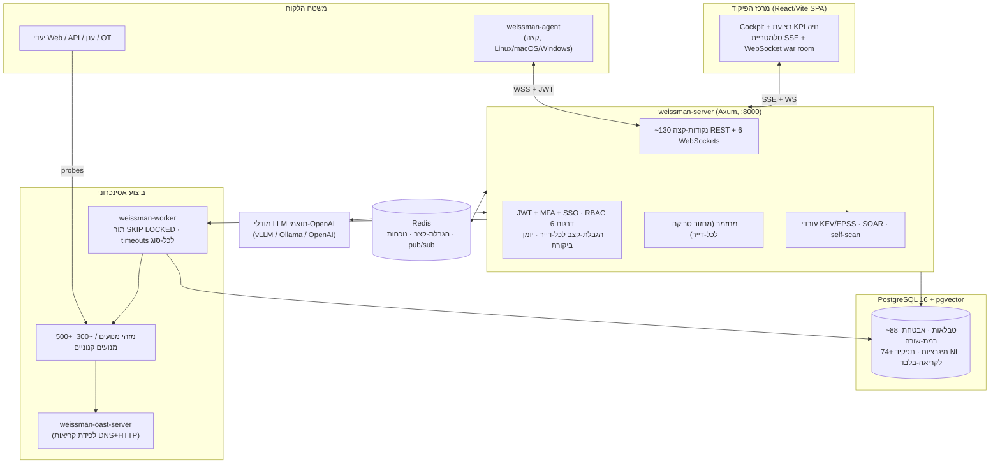

# Weissman Cybersecurity — מסמך חברה ומערכת

**פלטפורמת אבטחה התקפית אוטונומית והגנה אקטיבית**

> הופק מתוך ניתוח ישיר, שורה-אחר-שורה, של קוד-המקור בפרודקשן (ולא מתוך חומר שיווקי).
> כל נתון, יכולת ובקרה המתוארים להלן ניתנים למעקב עד למימוש בפועל בקוד.

| | |
|---|---|
| **מוצר** | Weissman Cybersecurity Platform |
| **קטגוריה** | אבטחה התקפית אוטונומית + הגנה אקטיבית (Red-Teaming אוטומטי מתמשך, ASM, מודיעין איומים, SOAR, EDR/UEBA) |
| **אופן אספקה** | SaaS רב-דיירי + ניתן לאירוח עצמי; סוכן קצה חוצה-פלטפורמות (אופציונלי) |
| **גרסה נוכחית** | CalVer `2026.06.2` ("Liminal Boundary Engine") |
| **שפת ליבה** | Rust (בטוחת-זיכרון; קוד `unsafe` אסור בכל הקרייט) |
| **היקף** | כ-193,000 שורות קוד מקורי ב-Rust, React, SQL ו-Python |
| **רישוי** | קנייני (Proprietary) |

---

## תוכן עניינים

1. [תקציר מנהלים](#1-תקציר-מנהלים)
2. [מה הפלטפורמה עושה](#2-מה-הפלטפורמה-עושה)
3. [ארכיטקטורת המערכת](#3-ארכיטקטורת-המערכת)
4. [מערכת המנועים — הליבה הקניינית](#4-מערכת-המנועים--הליבה-הקניינית)
5. [שלמות הזיהוי ואינטליגנציית הממצאים](#5-שלמות-הזיהוי-ואינטליגנציית-הממצאים)
6. [צינור מודיעין האיומים](#6-צינור-מודיעין-האיומים)
7. [מידול סיכון, נתיבי תקיפה ורדיוס נזק פיננסי](#7-מידול-סיכון-נתיבי-תקיפה-ורדיוס-נזק-פיננסי)
8. [שכבת ה-AI האוטונומית](#8-שכבת-ה-ai-האוטונומית)
9. [תזמור ולולאת הפנטסט האוטונומית](#9-תזמור-ולולאת-הפנטסט-האוטונומית)
10. [סוכן הקצה ו-UEBA](#10-סוכן-הקצה-ו-ueba)
11. [העובד האסינכרוני ומערכת המשימות](#11-העובד-האסינכרוני-ומערכת-המשימות)
12. [אימות מחוץ-לתחום (OAST)](#12-אימות-מחוץ-לתחום-oast)
13. [SOAR, פלייבוקים והתראות](#13-soar-פלייבוקים-והתראות)
14. [הטעיה, בלימה וריפוי-עצמי](#14-הטעיה-בלימה-וריפוי-עצמי)
15. [שכבת הנתונים: PostgreSQL, ריבוי-דיירים ומיגרציות](#15-שכבת-הנתונים-postgresql-ריבוי-דיירים-ומיגרציות)
16. [שרת ה-API, אימות, RBAC והקשחה](#16-שרת-ה-api-אימות-rbac-והקשחה)
17. [תצפיתיות, זמינות גבוהה וגיבויים](#17-תצפיתיות-זמינות-גבוהה-וגיבויים)
18. [מרכז הפיקוד (ממשק הווב)](#18-מרכז-הפיקוד-ממשק-הווב)
19. [פריסה ותשתית](#19-פריסה-ותשתית)
20. [איכות הנדסית ושערי CI/CD](#20-איכות-הנדסית-ושערי-cicd)
21. [השכבה המסחרית: חיוב, קליטה וציות](#21-השכבה-המסחרית-חיוב-קליטה-וציות)
22. [עמדת בטיחות וממשל](#22-עמדת-בטיחות-וממשל)
23. [מחסנית הטכנולוגיה](#23-מחסנית-הטכנולוגיה)
24. [היקף הנדסי (במספרים)](#24-היקף-הנדסי-במספרים)
25. [סטטוס כן והערות מפת-דרכים](#25-סטטוס-כן-והערות-מפת-דרכים)
- [נספח א' — קטלוג המנועים המלא (303 מנועים קנוניים)](#נספח-א--קטלוג-המנועים-המלא-303-מנועים-קנוניים)
- [נספח ב' — מצאי טבלאות מסד-הנתונים המלא (88 טבלאות)](#נספח-ב--מצאי-טבלאות-מסד-הנתונים-המלא-88-טבלאות)
- [נספח ג' — מצאי נקודות-הקצה (API) המלא](#נספח-ג--מצאי-נקודות-הקצה-api-המלא)
- [נספח ד' — מצאי עמודי מרכז-הפיקוד המלא](#נספח-ד--מצאי-עמודי-מרכז-הפיקוד-המלא)

---

## 1. תקציר מנהלים

Weissman Cybersecurity היא **פלטפורמת אבטחה אוטונומית בלולאה-סגורה** התוקפת באופן מתמשך את משטח-התקיפה של הארגון עצמו בדיוק כפי שיריב אמיתי היה עושה, מאמתת את ממצאיה בראיות חיות, מתמחרת את הסיכון העסקי בדולרים, ויכולה להגן, לבלום ולתקן באופן אוטומטי — הכל תחת ממשל בטיחות רב-שכבתי וקפדני.

זו **אינה** סורקת פגיעויות עם דאשבורד. זוהי מערכת משולבת המשלבת:

- **קטלוג עצום של מנועי אבטחה** — מעל 500 מזהי מנועים בקטלוג המוצר, הממופים לכ-300 מנועים קנוניים הממומשים בנפרד, המשתרעים על Web, API, ענן, רשת, OT/ICS/IoT, זהות, שרשרת-אספקה, AI/LLM, קריפטוגרפיה, OSINT וזיהוי ברמת המארח. **כל מנוע מחובר ל-probe אמיתי** (HTTP, TCP, UDP, DNS, TLS, או טלמטריית סוכן); הקוד אוסר במפורש ממצאים מזויפים או אקראיים.
- **"מועצת עליון" אוטונומית מבוססת-AI** — דיבייט יריב רב-מודלי (מציע התקפי, מבקר הגנתי "עיוור", ומקבל-החלטות ריבוני) עם **זיכרון מבוסס מסד-נתונים וקטורי של הצלחות עבר**, שערי אישור אנושי בלולאה (HITL), ושובל ביקורת חתום קריפטוגרפית.
- **שכבת שלמות-זיהוי** — זהות ממצא יציבה, deduplication, אשכול (clustering), לולאת משוב false-positive עם שקלול ביטחון בייסיאני, ו-attestation קריפטוגרפי לכל ממצא.
- **מודיעין איומים חי** — מראות מקומיות של CISA KEV ו-FIRST.org EPSS, המעשירות כל ממצא נושא-CVE בהסתברות-ניצול ובסטטוס "מנוצל-בפועל" ברגע שהוא נשמר.
- **סיכון עסקי כמותי** — מודל מיושר-FAIR הממיר ממצאים טכניים לסכומי Single/Annualized Loss Expectancy בדולרים, בתוספת הסקת נתיבי-תקיפה מבוססת-גרף (Dijkstra מנכסים חשופי-אינטרנט אל "תכשיטי הכתר").
- **הגנה אקטיבית** — פלייבוקי SOAR, honeytokens/canaries בענן, בלימת רשת, ויצירת טלאי תיקון אוטומטי המאומת ב-Docker שפותח Pull Requests.
- **מישור-בקרה ארגוני** — API בן ~130 נקודות-קצה עם JWT + TOTP MFA + SSO (OIDC/SAML), RBAC בן שש דרגות, בידוד רב-דיירי ברמת-שורה ב-PostgreSQL, הגבלת-קצב לכל-דייר, ו"מרכז פיקוד" עשיר ב-React של כ-69 עמודים תפעוליים.

המערכת בנויה ב-**Rust** לבטיחות-זיכרון וביצועים (כל בסיס-הקוד אוסר קוד `unsafe` למעט חריג יחיד ומתועד), מסופקת כקונטיינרים / Kubernetes / systemd / Nix, ומגיעה עם תצפיתיות פרודקשן (Prometheus, OpenTelemetry), זמינות-גבוהה עם בחירת-מנהיג, וגיבויים אוטומטיים.

**ההתחייבות הארכיטקטונית החשובה ביותר היא שלמות:** הממצאים מגיעים מ-probes אמיתיים, פלט ה-AI עובר אישור אנושי ומאומת מחוץ-לתחום לפני שהוא "נלמד", וכל פעולה מורשית נרשמת ביומן. זה הופך את פלט הפלטפורמה לבר-הגנה — רף האיכות שמצופה מתוכנת-תשתית.

---

## 2. מה הפלטפורמה עושה

ברמה הגבוהה ביותר, הפלטפורמה מריצה לולאה אוטונומית ומתמשכת לכל לקוח:

1. **גילוי** משטח-התקיפה האמיתי של הלקוח (דומיינים, תת-דומיינים, כתובות IP, פורטים, נכסי ענן, ספקי SaaS/זהות, תלויות תוכנה) באמצעות OSINT וסריקה אקטיבית.
2. **תקיפה** של משטח זה באמצעות מאות מנועים מתמחים המדמים טכניקות יריב אמיתיות — בבטחה ובתוך תחום מאושר.
3. **אימות** כל בעיה אפשרית בראיות חיות, כולל קריאות-חזרה מחוץ-לתחום לפגיעויות "עיוורות" וארגזי-חול ארעיים ב-Docker להוכחת-ניצול.
4. **העשרה ותיעדוף** כל ממצא עם מודיעין-ניצול חי (KEV/EPSS), ביצוע deduplication ואשכול, שקלול לפי דיוק היסטורי, ותמחור בדולרים של נזק עסקי.
5. **הסקה** על התוצאות באמצעות מועצת AI רב-מודלית המציעה, מבקרת ומחליטה על שרשראות-תקיפה ותיקונים — תחת אישור אנושי היכן שזה חשוב.
6. **הגנה ותיקון** אוטומטיים: הפעלת פלייבוקי SOAR, פריסת נכסי הטעיה, בלימת מארחים שנפרצו, ופתיחת Pull Requests מאומתים לתיקון.
7. **דיווח** לכל קהל: מרכז-פיקוד תפעולי חי, מסמכי PDF מנהליים לדרג הדירקטוריון, ועמדת ציות מול SOC 2 / ISO 27001 / GDPR.

לפיכך אותה פלטפורמה משרתת אנליסט SOC (תיעדוף וצַיִד), מהנדס אבטחה (ממצאים מאומתים ותיקון אוטומטי), CISO (סיכון בדולרים ועמדת ציות), וכן MSSP/ספק-שירות (תפעול רב-דיירי על-פני ארגונים רבים).

---

## 3. ארכיטקטורת המערכת

הפלטפורמה היא **workspace** של Rust בן תשעה קרייטים, בתוספת frontend ב-React ושכבת כלי-Python מדור-קודם דקה.



**קרייטים ב-Workspace (Rust):**

| קרייט | תפקיד |
|---|---|
| `fingerprint_engine` | לב המערכת: ~239 מודולים — כל מנועי האבטחה, התזמור, מועצת ה-AI, השמירה, המודיעין, האימות ושכבת ניתוב ה-HTTP (~78K שורות `.rs` + ~18K שורות קבצי handler `.inc`). |
| `backend/weissman-server` | בינארי ה-HTTP בפרודקשן — בונה את ראוטר Axum, מיישם את מחסנית-האבטחה (middleware), מנהל בריכות-DB, ומריץ שומרי-בטיחות באתחול. |
| `backend/weissman-core` | מודלים משותפים, רישום מזהי-המנועים הסמכותי, מדיניות TLS, הגדרות OpenAPI. |
| `backend/weissman-engines` | trait מנועים ניתן-להרחבה (`CyberEngine`) ולקוח ה-LLM תואם-OpenAI. |
| `crates/weissman-db` | גישה למסד-נתונים, בריכות-חיבור, ומריץ-המיגרציות הדו-שלבי המותאם-אישית. |
| `crates/weissman-worker` | צרכן המשימות האסינכרוני העצמאי. |
| `crates/weissman-agent` | סוכן הזיהוי + UEBA חוצה-הפלטפורמות בקצה (בינארי יחיד ~5MB). |
| `crates/weissman-oast-server` | מאזין אינטראקציות מחוץ-לתחום (DNS + HTTP) עצמאי לאימות פגיעויות עיוורות. |
| `fuzz_core` | פרימיטיבים משותפים ל-fuzzing. |

---

## 4. מערכת המנועים — הליבה הקניינית

### 4.1 איך מנועים עובדים

כל הסריקה זורמת דרך מתזמר מרכזי יחיד (`engine_dispatch::run_engine`). העיצוב אוכף שלוש אינווריאנטות יוצאות-דופן לקטגוריית מוצר זו:

1. **נקודת-כניסה יחידה ומשוערת.** כל קריאת מנוע עוברת דרך פונקציה אחת המאמתת שהמנוע הוא מנוע-פרודקשן אמיתי, מנתבת מנועים הדורשים-סוכן אל סוכן-הקצה, ומתייגת כל ממצא במנוע-המקור שלו לצורך שרשרת-ראיות מלאה.
2. **פרימיטיבי probe אמיתיים ומשותפים.** מודול יחיד (`engine_probes.rs`) מספק את פרימיטיבי-הרשת היחידים שהמנועים רשאים להשתמש בהם: לקוחות HTTP/1.1 ו-HTTP/2, TCP גולמי, probes ב-UDP, DNS (A/TXT/MX/CAA), ופענוח תעודות TLS באמצעות OpenSSL. כותרת המודול מצהירה ישירות: *כל פונקציית-עזר מבצעת פעולות רשת חיות; אין ממצאים מדומים.*
3. **אין-אות פירושו אין-ממצא.** כשמנוע אינו צופה דבר, הוא מחזיר אפס ממצאים עם ההודעה "no live signal observed" — הוא אינו ממציא תוצאה.

המנועים רשומים ברשימה סמכותית (`PRODUCTION_ENGINE_IDS`) ב-`backend/weissman-core`, וסקריפט CI (`verify_engine_wiring.mjs`) **מכשיל את ה-build** אם מנוע כלשהו המוצג בממשק חסר נתיב-ביצוע אמיתי. כך המוצר שומר על כנות הקטלוג שלו.

### 4.2 הקטלוג (לפי תחום)

קטלוג המוצר חושף **מעל 500 מזהי מנועים** (רישום ה-frontend מונה ~529; רישום-הביצוע המסודר מגדיר ~303 מנועים קנוניים; השאר הם כינויים אנכיים/שיווקיים שמתמפים למימושים קנוניים). מבין המנועים הקנוניים, ~49 הם **דורשי-סוכן** (טכניקות ברמת-מארח שלא ניתן לצפות בהן מרחוק, ומסומנות ככאלה); השאר רצים מרחוק. תחומים מרכזיים:

| תחום | מנועים מייצגים | מה הם עושים בפועל (מהקוד) |
|---|---|---|
| **Web ו-API** | BOLA/IDOR, GraphQL deep attack, JWT, OAuth/OIDC, SAML, SSRF (מתקדם), XXE, SSTI, HTTP smuggling, cache poisoning, prototype pollution, WebSocket, WAF bypass, CORS, subdomain takeover, **Liminal Boundary** (גלאי שבר פרוטוקול HTTP/1 מול HTTP/2) | בדיקת HTTP חיה עם payloads, ניתוח כותרות/JSON, דיפרנציאלים בייסליין-מול-מוטציה, introspection ב-GraphQL, SSRF עם metadata-canaries |
| **ענן** | AWS/Azure/GCP, Kubernetes/קונטיינר, serverless, IaC misconfig, container registry, Cloud Hunter | SSRF לנקודות-מטא-דאטה, enumeration של S3/Azure/GCP, זיהוי השתלטות DNS תלוי, בדיקות חשיפת IAM/K8s |
| **רשת** | רשת-מתקדם (TCP/UDP אמיתי), SMB/NetBIOS, IPv6, mTLS/gRPC, BGP/DNS hijacking, timing | באנרי TCP, probes שירותי UDP, אימות-דואר DNS (SPF/DMARC/CAA), host-header rebinding, ניתוח timing ב-HTTP |
| **OT / ICS / IoT** | Modbus, BACnet, OPC-UA, MQTT, CoAP, SCADA, IoT firmware, BLE/RF | probes אמיתיים בפרוטוקולים תעשייתיים (למשל Modbus FC03 מעל TCP/502), טביעת-אצבע פורטים ובאנרים של IoT |
| **זהות** | Kerberoasting, password spray, מנוע-זהות, הסלמת-הרשאות אוטונומית | סריקת פורטי AD, anonymous LDAP bind, replay של JWT/סשן רב-תפקידי, בדיקות HMAC |
| **שרשרת-אספקה** | מנוע שרשרת-אספקה, SBOM analyzer, ניטור typosquatting, CI/CD | מושך את ה-manifests/SBOMs של היעד עצמו, מנתח lockfiles, מבצע שאילתות OSV **רק עבור גרסאות הקיימות בפועל** ביעד |
| **AI / LLM** | מנועי AI מתקדמים, LLM fuzzer, LLM red-team, adversarial ML, generative fuzzing | probes חיים של נקודות-קצה LLM: jailbreak canaries, plugin manifests, DoS באמצעות מיצוי-טוקנים, prompt-injection |
| **Recon / OSINT** | OSINT, ASM, discovery/spider, גילוי-דומיינים אוטומטי, leak hunter, סריקת סודות ב-GitHub, passive DNS | תת-דומיינים מ-Certificate Transparency (crt.sh), סריקות פורטים, crawling, ציד דליפות |
| **קריפטוגרפיה** | PKI/TLS, סורק post-quantum (PQC), padding-oracle/RSA-timing | בדיקת תעודות TLS, עמדת מוכנות PQC, ערוצי-צד קריפטוגרפיים |
| **Malware / התחמקות / הנדסה-חברתית** | EDR evasion, anti-forensics, מנועי stealth, משטח הנדסה-חברתית | היוריסטיקות מרחוק + בדיקות ברמת-מארח דרך הסוכן; אימות-דואר וגילוי OAuth (לעולם לא נשלחים payloads של פישינג) |
| **אמולציית APT** | מנועי APT מתקדמים, אמולציית איומים (7 פרסונות שחקנים) | ממפה משטחי גישה-ראשונית מתועדים של שחקנים (Exchange OWA, Citrix, RDP/SMB חשופים) לראיות חיות; מסווג חסום מול לא-חסום |
| **Fuzzing** | fuzzer מבוסס-משוב, eternal fuzz, semantic fuzzer, OOB fuzz | זיהוי אנומליות בייסליין-מול-מוטציה עם מוטציה מונחית-LLM אופציונלית ואישור מחוץ-לתחום |

### 4.3 סינתזת ניצול ואימות

עבור דריסות-רגל מאומתות, **מנוע סינתזת הוכחת-הניצול (PoE)** (`exploit_synthesis_engine.rs`, המודול הבודד הגדול ביותר בכ-2,800 שורות) מריץ צינור ממושמע: טביעת-אצבע בייסליין → התאמת CVE מול NVD → עד 512 probes דינמיים מקבילים → טריגרים היוריסטיים (5xx, timeouts, אנטרופיה/דליפת-זיכרון, timing) → **PoC מסונתז ב-LLM עם מסילות-בטיחות** ותיקון-עצמי → **סולם-אימות** רב-שכבתי:

- **ארגז-חול ארעי ב-Docker** (`poc_sandbox.rs`) המריץ מחדש את ה-PoC מול היעד שבתחום, עם מגבלות משאבים נוקשות (256MB RAM, 0.5 CPU), ומסמן "מאומת" רק בקבלת קריאת-חזרה מחוץ-לתחום או סמן-תגובה צפוי;
- **קורלציית קריאת-חזרה OAST** למחלקות עיוורות;
- **שופט LLM סמנטי** עם סף-ביטחון מינימלי.

ארגז-חול נפרד ל**"אימות 200%"** (`verification_sandbox.rs`) מאמת *תיקונים*: הוא משכפל את ריפו-היעד, מקים **קונטיינר Docker מונע-Bollard**, מאשר שהניצול עובד לפני-הטלאי, מיישם את הטלאי המועמד, מאתחל מחדש, ומאשר שהניצול כבר אינו עובד — לפני שנפתח Pull Request כלשהו.

---

## 5. שלמות הזיהוי ואינטליגנציית הממצאים

שכבה זו היא מה שמבדיל פלטפורמה אמינה מסורק רועש. הכל ממומש בקוד:

- **זהות ממצא יציבה.** מזהה כל ממצא הוא hash של *אינווריאנטות בלבד* (מנוע, יעד, CVE, CWE, טכניקת MITRE, חתימה, כותרת מנורמלת) — תוך החרגה מפורשת של חותמות-זמן וגופי-תגובה — כך שאותה בעיה המזוהה-מחדש בסריקה הבאה היא *אותו* ממצא, לא כפילות.
- **deduplication אמיתי.** אילוץ `UNIQUE(tenant_id, client_id, finding_id)` עם `ON CONFLICT DO UPDATE` מרענן ראיות ומגדיל `seen_count` / `last_seen_at`, תוך **שימור הסטטוס שנקבע ע"י האנליסט** (acknowledged / fixed / false-positive) לאורך סריקות חוזרות.
- **אשכול.** ממצאים מאושכלים לפי `sha256(target ‖ signature ‖ cwe)` (עם נרמול URL), ומאחדים את המנועים, המקורות, ה-CVEs וחומרת/CVSS/EPSS המקסימליים שתרמו.
- **לולאת משוב false-positive.** סימוני TP/FP של אנליסט מזינים **מכפיל-ביטחון** בשקלול בייסיאני (Bayesian shrinkage) = `(tp+1)/(tp+fp+1)`, מהודק לטווח `[0.1, 1.0]`, המוחל על ציון-הסיכון בזמן-קריאה. שלושה סימוני false-positive על אותו `(מנוע, חתימה)` **מדכאים אוטומטית** את הזיהוי הבא — תוך שימור שובל-הביקורת.
- **attestation קריפטוגרפי.** בזמן השמירה, כל ממצא מקבל קבלת HMAC-SHA256 על שדותיו הבלתי-משתנים, כך שניתן לזהות חבלה בממצאים שמורים בעת קריאה.
- **קורלציית kill-chain.** מעבר ל-dedup, מנוע חוקי-קורלציה מקבץ שלבי-ממצא מסודרים בתוך חלון-זמן לאירועים.
- **תיעדוף ברירת-מחדל.** הממצאים ממוינים `KEV → EPSS → CVSS × ביטחון` — כלומר, בעיות מנוצלות-בפועל ובעלות הסתברות-ניצול גבוהה צפות ראשונות, משוקללות בדיוק ההיסטורי של המנוע.

---

## 6. צינור מודיעין האיומים

הפלטפורמה מתחזקת **מראות מקומיות חיות** של מודיעין-ניצול סמכותי ומעשירה ממצאים אוטומטית:

| הזנה | מקור | תדירות-רענון | אחסון |
|---|---|---|---|
| **CISA KEV** (פגיעויות מנוצלות-בפועל) | הזנת JSON רשמית של cisa.gov | כל 6 שעות | טבלת `kev_intel` |
| **FIRST.org EPSS** (ניקוד חיזוי-ניצול) | api.first.org | כל 12 שעות + לפי-דרישה בשמירה | טבלת `epss_intel` |
| **NVD CVE** | NIST NVD API 2.0 | חיפוש-מילות-מפתח מטמון | מטמון LRU בזיכרון |
| **OSV / GitHub Advisories** | osv.dev, GitHub | מטמון, מאוגד (batched) | LRU + מילוי-לאחור |

כל ממצא נושא-CVE מועשר בזמן השמירה ב-`epss_score`, `epss_percentile`, `kev_listed`, `kev_known_ransomware`, ו-`kev_due_date`. מילוי-לאחור ברקע מפענח מזהי GHSA/OSV ל-CVEs ומחשב מחדש את הדגלים הללו על-פני ממצאים קיימים. התוצאה: התיעדוף משקף **את מה שתוקפים מנצלים בפועל כעת**, ולא רק CVSS סטטי.

---

## 7. מידול סיכון, נתיבי תקיפה ורדיוס נזק פיננסי

הפלטפורמה הופכת אלפי ממצאים למספר קטן של החלטות:

- **גרף הסיכון.** גרף חי (`risk_graph_nodes` / `risk_graph_edges`) מודל נכסים, זהויות, רשתות, חבילות, ריפוזיטוריות, משאבי-ענן ואשכולות Kubernetes, עם קשתות כמו *exposes*, *authenticates*, *affects*, *leads_to*. הצמתים מנוקדים ו**נקודות-חנק** (צמתים בעלי דרגה גבוהה ומגוון סוגי-קשת) מסומנות אוטומטית.
- **הסקת נתיבי-תקיפה.** חיפוש Dijkstra למסלול הקצר ביותר רץ מכל צומת `internet_exposed` אל כל צומת `crown_jewel`, עם משקלי-קשת הנגזרים מה-CVSS + EPSS×1.5 + KEV×2 הגרועים ביותר של כל צומת. הוא מחזיר את K המסלולים המובילים (ברירת-מחדל 25, מקסימום 12 קפיצות) ואת נקודות-החנק המופיעות ב-≥50% מהם — כלומר, *"תקן את הצומת הזה ותשבור את רוב נתיבי-התקיפה."* תצלומי-מצב נשמרים לניתוח-מגמות.
- **רדיוס-נזק פיננסי (מיושר-FAIR).** הממצאים מתומחרים בדולרים:
  - **תוחלת-הפסד בודד:** `SLE = ערך_נכס × clamp(CVSS/10, 0.5, 1.0)`
  - **תוחלת-הפסד שנתית:** `ALE = SLE × clamp(EPSS×12, 0..12) × discount`, כאשר CVEs ברשימת-KEV מציבים רצפה לקצב-ההתרחשות השנתי על 1.0/שנה.
  - כללי תיוג ערך-נכס לכל-לקוח מאפשרים ללקוחות למפות תגיות-נכס משלהם לערכים בדולרים. הפלט מתגלגל ל-SLE הגרוע-ביותר, ALE שנתי, ערך תכשיט-הכתר, וסך ערך-הנכסים לכל לקוח.
- **זיכרון חיזוק לפנטסט.** כל payload מנצח-ומאומת מוטמע כווקטור בן 1536 ממדים הממופתח לטביעת-אצבע היעד (שרת + מחסנית-טכנולוגיה) ונשמר עם אינדקס HNSW ב-pgvector. בסריקה הבאה מול מחסנית *דומה*, המערכת מאחזרת הצלחות-עבר באמצעות חיפוש שכן-קרוב-בקירוב (ANN) — ועוקבת אחר שיעור-הצלחת-החזרה, כך שהלמידה-בחיזוק *מדידה*.

---

## 8. שכבת ה-AI האוטונומית

זוהי הקניין הרוחני המובחן ביותר של הפלטפורמה: **ארכיטקטורת-החלטות שכבתית** המשתמשת במספר מודלי-LLM באופן יריב, זוכרת מה עובד, ולעולם אינה ממיינת דבר לנשק ללא אימות ו(היכן שזה חשוב) אישור אנושי.

### 8.1 מועצת-העליון (דיבייט יריב רב-מודלי)

ממומשת ב-`council.rs` (~1,800 שורות), המועצה מעמתת מודלים שונים זה מול זה בתפקידים מוגדרים:

- **מציע התקפי** (למשל מודל ייעודי-קוד) המציע אסטרטגיות-תקיפה מובְנות כ-JSON — לא פרוזה מנושקת;
- **מבקר הגנתי** ש*עיוור במכוון ל-payload הקונקרטי* ומבקר את סיכון-הזיהוי וסבירות ה-false-positive;
- **גנרל ריבוני** בעל סמכות סופית המסנתז directive בר-פעולה-מכונית.

המועצה היא **אגנוסטית-לספק** — היא דוברת את פרוטוקול-הצ'אט של OpenAI ורצה מול vLLM, Ollama, OpenAI, או כל backend תואם, עם בחירת-מודל לכל-דייר. כל שלב **חתום ב-HMAC/SHA-256 לתוך יומן-הביקורת** כאירוע `COUNCIL_DEBATE`. לולאת תיקון-עצמי מבוססת-OAST מריצה מחדש את הדיבייט (עד מספר סבבים מוגדר) כש-probe חי אינו מאשר את האסטרטגיה.

### 8.2 זיכרון RAG — לולאת-למידה סגורה

אסטרטגיות מנצחות מוטמעות ונשמרות ב-`supreme_council_memory` (pgvector, אינדקס קוסינוס HNSW). לפני כל דיבייט חדש, המערכת מאחזרת את K ההצלחות-הקודמות הדומות ביותר באמצעות חיפוש שכן-קרוב-בקירוב ומזריקה אותן לפְּרוֹמְפְּט של המציע. באופן מכריע, **הזיכרון נכתב רק לאחר ש-probe מחוץ-לתחום מאשר הצלחה** — הלולאה לומדת מתוצאות מאומתות, לא מטענות המודל. כשלי-הטמעה מתדרדרים בחן (אין וקטורים מזויפים).

### 8.3 "Ask Weissman" — משפה טבעית ל-SQL בטוח

עיצוב-בטיחות בולט (`nl_query.rs`): המשתמשים שואלים שאלות בשפה טבעית; ה-LLM פולט **QueryPlan** מובְנֶה כ-JSON — *לעולם לא SQL גולמי*. השרת מאמת את התכנית מול allow-list (6 טבלאות, עמודות מנויות, 10 אופרטורים), מהדר אותה ל-SQL **פרמטרי** עם `tenant_id` שמוכרח לתוך כל שאילתה, ומריץ אותה מול **תפקיד PostgreSQL ייעודי לקריאה-בלבד** (`weissman_ro`) עם timeout של 15 שניות לפקודה. כל שאלה, ה-SQL המהודר, ספירת-השורות וההשהיה נרשמים ביומן. זה הופך ממשק-נתונים בשפה-טבעית לבטוח מספיק לפרודקשן.

### 8.4 סינתזת Genesis ו"מרתף החיסונים"

מועצה נפרדת ("Genesis") מאמתת שרשראות-תקיפה *מראש*: מציע בונה שרשרת, מבקר מגביל אותה, מודל-עקיפה בודק את ההגבלה, ואם השרשרת מתאמתת — מודל **"חיסון"** מפיק טלאי-תיקון *וגם* חתימת-זיהוי. שרשראות מאומתות הופכות לרשומות מוצפנות (AES-256-GCM) במרתף ומוזרמות בשידור חי ל"חדר-מלחמה" של המנכ"ל.

### 8.5 תת-מערכות "ריבוניות" אוטונומיות

משפחה של לולאות אוטונומיות (opt-in, כבויות כברירת-מחדל):

- **אבולוציה ריבונית** — בכישלון probe, מבקר מסיק את חוק-ה-WAF החוסם ומודל-האקר מסנתז עקיפה פולימורפית; "preflight בצללים" מדמה תגובות-קצה לפני כל פעולה חיה.
- **C2 ריבוני** — מסובב honeytokens ורמזי-קפיצת-פורט חתומים לנכסי-הטעיה; יכול להעלות את רמת-ההגנה של ספק-הענן תחת התקפה (מאחורי דגלי אישור-כפול מפורשים).
- **מפעל הפנטומים** — מייצר מפתחות-SSH, JWTs ותצורות-API מזויפים כחומר-מלכודת.
- **Nexus Sovereign Swarm** — נחיל היפר-סקיילי של עד ~10,000 סוכנים וירטואליים (ארכיטיפים: סייר, מנצל, מתאם, חמקני, אורקל) המגיעים לקונצנזוס רב-סוכני על ממצאים.

כל אחת מאלה נשלטת על-ידי דגלי-סביבה שברירת-מחדלם **כבויה**, וכמה דורשות אישור-כפול מפורש כדי לבצע פעולות-ענן בעלות-השלכה.

### 8.6 מנועי חיזוי ואמולציה

- **חיזוי zero-day** — התאמה היוריסטית + טביעת-אצבע מול טבלה אצורה של רכיבים בסיכון-גבוה וצפיפות ה-CVE ההיסטורית שלהם.
- **תאום דיגיטלי** — בונה פרופיל-סביבה מכותרות חיות; תרחישי-סיכון מייעצים מסומנים בבירור וכבויים כברירת-מחדל.
- **אמולציית איומים** — מריץ שבעה תרחישי פרסונת-APT ומדווח אילו נחסמו.
- **מתכנן שרשראות-תקיפה דטרמיניסטי** — מתכנן בסגנון STRIPS הגוזר שרשראות-תקיפה **רק מעובדות שנצפו** (הוא אינו יכול להזות יכולות), המשלים את המתכנן הנרטיבי מבוסס-LLM.

---

## 9. תזמור ולולאת הפנטסט האוטונומית

מתזמר לכל-דייר מריץ מחזורי-סריקה מתמשכים (במרווח ניתן-לתצורה) וצינור קפדני בן חמישה שלבים:

| שלב | שם | פעילות |
|---|---|---|
| 0 | מודיעין גלובלי | zero-day radar / סריקת מודיעין-איומים |
| 1 | גילוי עמוק | OSINT + מיפוי משטח-תקיפה, בתוספת חיזוי-נתיבים בסיוע-LLM |
| 2 | סריקת פגיעויות | מערך המנועים המלא, מצומצם למנועים-המאופשרים של כל לקוח |
| 3 | מהלומת-מחץ | סינתזת PoE — **רק אם קיימת דריסת-רגל/ממצא** (משוער) |
| 4 | ציות | hash-שורש לביקורת + הפקת דוחות |

המנועים לכל לקוח הם החיתוך בין `enabled_engines` של הלקוח ל-`active_engines` של הדייר. הֶקְשֵׁר-גילוי משותף מזין רשימות-מילים ספציפיות-למחסנית (PHP/Django/Spring/Express וכו') ונתיבים שהתגלו בחזרה אל ה-fuzzers. **מצב-בטוח גלובלי** מרחיב את ה-jitter ומכניס השהיות בין-מנועים לחמקנות. כל הלולאה עטופה בבידוד-panic ומפסקי-זרם כך שמנוע בודד שמשתבש אינו יכול להפיל את המערכת.

---

## 10. סוכן הקצה ו-UEBA

בינארי Rust יחיד חוצה-פלטפורמות (`weissman-agent`, ~5MB) רץ על Linux, macOS ו-Windows כשירות. הוא נרשם מעל HTTPS לקבלת JWT לכל-סוכן, מתחזק **סשן WSS (WebSocket-מעל-TLS)** עם heartbeats וחיבור-מחדש בנסיגה-מעריכית, ואינו מחזיק מצב מקומי קבוע.

**זיהויים ברמת-המארח** (~20 יכולות מפורסמות על-פני ~13 מודולי-מימוש) כוללים: זיהוי process-hollowing (היוריסטיקת נתיב-exe חסר), DLL-hijack / הרצה מתיקייה ברת-כתיבה, מצאי-תהליכים, מניית-מנגנוני-התמדה (cron / systemd / launchd / משימות-מתוזמנות), בדיקות ARP / MAC של שער ספּוּפינג, היוריסטיקות אנומליית-DNS / ערוץ-סמוי, דגימת חילוץ-לוח (גודל + אנטרופיה), נוכחות EDR/AV (18 מוצרים ידועים), בדיקות שלמות-יומן, ומניית התקני-USB.

**דוגם בייסליין UEBA** (`baseline.rs` בסוכן, `ueba_detector.rs` בשרת): הסוכן דוגם תקופתית פורטים פתוחים, תהליכים מובילים, משתמשים ייחודיים, עומס/זיכרון, וכניסות-כושלות, מקובצים לפי **שעת-השבוע** (0–167). השרת מתחזק בייסליין מתגלגל בן 7 ימים לכל `(סוכן, מדד, שעת-שבוע)` ומפעיל **גלאי z-score**: `|z| > 3` → בינוני, `|z| > 6` → גבוה, בתוספת זיהוי קטגורי של פורטים/תהליכים שלא-נראו-מעולם — אך רק לאחר חלון-למידה קפדני (≥24 דגימות בדלי), כך שאינו מופעל בטרם-עת. דגימות נשמרות 14 ימים.

---

## 11. העובד האסינכרוני ומערכת המשימות

ה-`weissman-worker` הוא צרכן-משימות מבוזר עמיד:

- **שליפה-מתור** באמצעות `FOR UPDATE SKIP LOCKED` של PostgreSQL, נתמך באינדקס חלקי `(created_at, kind) WHERE status='pending'` שהפך שאילתה-חמה רב-שנייתית לסריקת-אינדקס של אלפיות-שנייה.
- **חכירה ו-heartbeats** — נעילה בת 300 שניות המוארכת כל 30 שניות; משימות תקועות נדרשות-מחדש.
- **נתיבי-מקביליות נפרדים** — סמפורים קלים (ברירת-מחדל 8) וכבדים (ברירת-מחדל 2); תפקיד-בריכה יכול להגביל עובד למשימות מחקר מול לקוח.
- **timeouts לכל-סוג** — מ-30 שניות (`ping`) ועד 60 דקות (`tenant_full_scan`), עם ~27 סוגי-משימות נבדלים (סריקות מלאות, דיבייטי-מועצה, deep fuzz, סינתזת PoE, auto-heal, ריצות מודיעין-איומים, סריקות-ענן, פריסות-הטעיה ועוד).
- **בידוד-panic ו-dead-lettering** — כל משימה רצה ב-task משלה עם ביטול-בעת-timeout וניסיון-חוזר בנסיגה-מעריכית למצב dead-letter.

---

## 12. אימות מחוץ-לתחום (OAST)

עבור מחלקות-פגיעות "עיוורות" (blind SSRF/XXE, JNDI בסגנון Log4Shell, הזרקה מחוץ-לתחום), הפלטפורמה מריצה **שרת OAST עצמאי** (`weissman-oast-server`) המאזין גם ב-**HTTP וגם ב-DNS**, לוכד אינטראקציות הממופתחות ב-token ייחודי, ורושם כתובת-IP מקור, שיטה, נתיב, כותרות ופרטי-שאילתת-DNS למסד-הנתונים. המנועים מטמיעים tokens לכל-סריקה ב-payloads; ה-fuzzer לאחר מכן דוגם את המאזין כדי לאשר שקריאת-חזרה אמיתית התרחשה לפני סימון ממצא כמאומת. זהו ההבדל בין "שלחנו payload" לבין "הוכחנו שהיעד יצר איתנו קשר".

---

## 13. SOAR, פלייבוקים והתראות

**פלייבוקי SOAR** (`soar_playbook.rs`) משתמשים ב-DSL מבוסס-JSON:

```
when { severity, kev, epss_min, exposed, engines, cve_prefixes, cooldown_seconds }
do   [ ...actions ]
```

שבעה סוגי-פעולה ממומשים: `set_status`, `slack_notify`, `webhook`, `http_post`, `open_pr` (מתור משימת auto-heal מאומתת), `isolate_host`, ו-`page_oncall`. השיגור הוא **אידמפוטנטי** (מפתח-dedup מבוסס SHA-256 עם חלון-cooldown) ונרשם במלואו ביומן. כל ממצא חדש שנשמר מוערך מול הפלייבוקים המאופשרים אוטומטית. **PlaybookBuilder** חזותי בממשק מספק בדיקת dry-run.

**חוקי התראה** הם מנגנון נפרד ופשוט יותר עם מעריך משלו (דוגם ממצאים אחרונים כל 60 שניות) וחמישה ערוצי-מסירה: webhook, Slack, Microsoft Teams, PagerDuty, ודוא"ל (SMTP) — עם deduplication של הפעלות לכל-ממצא.

---

## 14. הטעיה, בלימה וריפוי-עצמי

**הטעיה / הגנה אקטיבית:**
- **honeytokens** המיוצרים דינמית (מפתחות AWS, אישורי-DB, מפתחות-API, נקודות-קצה צללים) ללא סודות מקודדים-קשיח.
- **canaries אמיתיים ב-AWS** — יוצר משתמש IAM עם מדיניות deny-all ומפתח-גישה, שותל ארטיפקטים מטעים ב-S3 / SSM Parameter Store של הלקוח באמצעות assume-role חוצה-חשבונות, ומנטר דרך URL של OAST ו-webhook חתום של EventBridge; כל שימוש במפתח-ה-canary מעורר התראה.
- **blackholing של Cloudflare** — חסימה אופציונלית של ASN או /24 של תוקף בעת פגיעת-canary (מאחורי דגלי אישור-כפול).

**בלימה** (`cloud_containment_engine.rs`): הסגר EC2 (security group חדש לזיהוי-פלילי בלבד) ו-NetworkPolicy מסוג deny-by-default ב-Kubernetes.

**ריפוי-עצמי:** פעולת ה-SOAR `open_pr` מתור משימה המיישמת טלאי-מועמד, **מאמתת אותו בקונטיינר Docker ארעי** (הניצול עובד לפני, נכשל אחרי), ופותחת ענף + Pull Request ב-GitHub — תוך מחיקת ה-token של git לאחר השלמה.

---

## 15. שכבת הנתונים: PostgreSQL, ריבוי-דיירים ומיגרציות

- **PostgreSQL 16 + pgvector** (תוסף-הווקטור מפעיל את זיכרון-ה-AI ואת חיזוק-הפנטסט). ~88 טבלאות-יישום על-פני סכמת-public מבוססת-דייר, סכמת `intel` גלובלית, ומראות EPSS/KEV; מוגדרות על-ידי **74+ מיגרציות SQL** (~4,000 שורות).
- **בידוד רב-דיירי באמצעות Row-Level Security.** לכל טבלת-דייר יש מדיניות `ENABLE` + `FORCE ROW LEVEL SECURITY` הממופתחת ל-GUC מקומי-לטרנזקציה `app.current_tenant_id`. תפקיד-היישום כפוף ל-RLS; תפקיד-אימות נפרד עם `BYPASSRLS` מצומצם בקפדנות לבדיקות-כניסה ונרשם בעצמו ביומן (עם שלילה-אוטומטית בגישה חוצת-דיירים חשודה).
- **שלושה תפקידי מסד-נתונים:** `weissman_app` (כפוף-RLS), `weissman_auth` (כניסה בלבד), ו-`weissman_ro` (תפקיד הקריאה-בלבד לממשק השאילתות בשפה-טבעית, מוגבל ל-whitelist טבלאות הדוק עם timeout-פקודה ומגבלות-זיכרון משלו).
- **מריץ-מיגרציות דו-שלבי מותאם-אישית** (`no_tx_migrations.rs`) המזהה כותרת `-- weissman:no-transaction` ומריץ מיגרציות בסגנון `CREATE INDEX CONCURRENTLY` **מחוץ לכל טרנזקציה**, רושם אותן ב-`_sqlx_migrations` עם checksums תואמי-SQLx מסוג SHA-384 כך שהמריץ הסטנדרטי מדלג עליהן בבטחה. תלויות נדחות מיושמות-מחדש לאחר שטבלאותיהן קיימות. (זוהי בעיה קשה אמיתית שנפתרה בנקיון.)

---

## 16. שרת ה-API, אימות, RBAC והקשחה

**ה-API** (`weissman-server`, Axum על `:8000`) חושף ~100 רישומי-ניתוב / ~130 נקודות-קצה שיטה-נתיב (ממומשות על-פני ~271 פונקציות-handler) בתוספת שישה ערוצי WebSocket, עם מפרט OpenAPI 3.1 ו-Swagger UI.

**אימות (שכבתי):**
- אסימוני-גישה **JWT** (HS256, TTL ברירת-מחדל 15 דקות, עם `jti` חובה לצורך שלילה), הנמסרים דרך עוגיית HttpOnly `Secure` או `Authorization: Bearer`.
- **אסימוני-רענון** הנשמרים רק כ-hashes של SHA-256, מסובבים בעת-שימוש, עם עוגיית `Strict`-SameSite המצומצמת ל-`/api/auth`.
- **TOTP MFA** (הגדרה/הפעלה/אימות/השבתה), עם אכיפה ברמת-הדייר המחזירה `403 mfa_enrollment_required` כשהמדיניות דורשת.
- **SSO** דרך **OIDC** (PKCE + nonce, הקצאת-משתמש JIT) ו-**SAML** (פרודקשן דורש אימות-חתימה של `xmlsec1`).
- **שלילת-אסימונים** — גם גישה (denylist של `jti`) וגם רענון, עם אימות-RBAC חי-מחדש בכל בקשה מאומתת.

**RBAC** — מודל מדורג בן שש דרגות: `viewer < analyst < operator < admin < ceo`, בתוספת דגל `superadmin` העוקף בדיקות-תפקיד, וזהות `agent` נפרדת. ההרשאה נאכפת בחמש שכבות: שומר-האימות, middleware של mutation-RBAC (כתיבות בלבד), middleware ייעודי ל-CEO, ~63 בדיקות-מפורשות לכל-handler, ולבסוף RLS של PostgreSQL. גם התחום נאכף: יעד-סריקה חייב להיפתר לדומיין/IP מאושר עבור הלקוח, אחרת הוא נדחה ב-`403`, עם חסימת IPs פרטיים/שמורים והצמדת המארח/IP שנפתרו ואימותם-מחדש בזמן-הביצוע.

**הקשחה** (חלק ניכר ממנה נאכף באתחול — השרת *מסרב לעלות* בפרודקשן אם מופר):
- מערך כותרות-אבטחה מלא (HSTS, CSP נוקשה, `X-Frame-Options: DENY`, `nosniff`, Referrer-Policy, Permissions-Policy).
- מדיניות TLS המסרבת ל-TLS לא-מאובטח בפרודקשן ומכריחה עוגיות `Secure`.
- שומרי-אתחול הדוחים סודות-JWT חלשים/ברירת-מחדל, סיסמאות-admin ברירת-מחדל, דילוג-אימות SAML לא-מאובטח, סיסמאות-DB ברירת-מחדל, אסימוני-metrics חסרים, ו(אלא אם single-node מאופשר במפורש) Redis חסר.
- **ארבע דרגות של הגבלת-קצב** (edge-לפי-IP, API-לפי-IP, כניסה/הרשמה, וסריקה-לפי-דייר), נתמכות-Redis כשזמין; נעילת-חשבון לאחר 10 כשלונות.
- **השוואות בזמן-קבוע** (`subtle`) לאישור פעולה-הרסנית ואימות webhook.
- הגנת SSRF על בקשות יוצאות, רישום-ביקורת append-only, מגיני-panic עם מפסקי-זרם לכל-תווית, וניקויי שימור-נתונים ניתנים-לתצורה.

---

## 17. תצפיתיות, זמינות גבוהה וגיבויים

- **מדדי Prometheus** ב-`/api/metrics` (מוגן-token): היסטוגרמות וספירות השהיית-HTTP, מדי בריכת-DB, מדי משימות-ממתינות ומחזורי-סריקה-פעילים, ומוני הצלחה/כשל גיבוי.
- **OpenTelemetry / OTLP** למעקב מבוזר עם לוגים מובְנים אופציונליים ב-JSON; מזהה-מעקב מועבר מבקשות-HTTP אל המשימות האסינכרוניות.
- **אפיק טלמטריית SSE** עם פיזור חוצה-רפליקות דרך Redis pub/sub המפעיל את מרכז-הפיקוד החי.
- **בחירת-מנהיג** דרך נעילה-מייעצת של PostgreSQL מבטיחה שיחידים (סריקות-המתזמר, גיבויים, מתזמנים, רענון-מודיעין) ירוצו בדיוק על צומת אחד — נכשלת *סגור* בפרודקשן.
- **גיבויי `pg_dump` אוטומטיים** עם gzip, מדיניות-שימור, וחותמות-זמן-הצלחה המיוצאות ל-Prometheus, משוערים לצומת-המנהיג.

---

## 18. מרכז הפיקוד (ממשק הווב)

יישום עמוד-יחיד ב-React 18 / Vite בן **~69 עמודים** עם נתחי-נתיב נטענים-בעצלות (lazy-loaded), בינאום (i18next), וויזואליזציות-נתונים עשירות (recharts, גלובוס three.js, גרפים מ-`@xyflow/react`, framer-motion, TanStack Table). הדגשים:

- **Cockpit** עם רצועת-KPI מנהלית דביקה בסגנון "בלומברג" (ציון-אבטחה, ממצאים פתוחים לפי חומרה עם דלתות 24 שעות, MTTR, ספירות-נכסים, תור-משימות, סטטוס צי-הסוכנים) המתרעננת כל 15 שניות, בתוספת הזנת-פעילות חיה מעל Server-Sent Events.
- **מפת מודיעין תלת-ממדית** (גלובוס מוזן-WebSocket עם קשתות-איום, kill-chain, radar) ו**חדר-מלחמה** קולנועי.
- משטחים תפעוליים: **FindingsCommandCenter** (טבלה ניתנת-לסינון + מגירה + ייצוא CSV), **RiskGraphVisualization** (גרף נתיבי-תקיפה אינטראקטיבי), **KillChainOrchestrator**, **ThreatHuntingWorkbench**, **PlaybookBuilder**, **AskWeissman** (צ'אט NL→SQL), **RemediationHub** (Kanban מממצאים חיים), **AgentManagement**, **ComplianceFrameworks**, **CloudControlTower**, **SupplyChainHub**, **OT/ICS**, **MobileSecurity**, **PQC Radar** ועוד.
- **מרכז-פיקוד למנכ"ל** עם חדר-המלחמה של Genesis, מרתף-החיסונים, מעבדה-ריבונית, מטריצת-מנועי god-mode, וזרמי-מועצה חיים — מאחורי נתיב מוגן ייעודי וה-middleware של RBAC ל-CEO.

---

## 19. פריסה ותשתית

מספר נתיבי-פריסה מהשורה הראשונה, כולם מאותם ארטיפקטים:

- **Docker Compose** — שער nginx (המגיש את ה-SPA, את אתר-השיווק, ומתווך `/api` + `/ws`), ה-backend, העובד, PostgreSQL (pgvector), ו-Redis; עם פרופיל-ניטור אופציונלי (Prometheus + Grafana + Alertmanager).
- **Kubernetes** (`deploy/k8s/`) — backend (2 רפליקות עם health probes), עובד, שער nginx (2 רפליקות), Redis, services, ingress (`weissmancyber.com`), ו-configmap; PostgreSQL מונח כמנוהל/חיצוני.
- **systemd** (`deploy/systemd/`) — `weissman.target` הרוצה את יחידות השרת והעובד, עם עוזר-התקנה; הממשק בנוי לתוך התיקייה-הסטטית של הבינארי (אין Node.js בפרודקשן).
- **Nix / NixOS** (`flake.nix`, `nix/nixos-modules/`) — בנייה רפרודוקטיבית (Crane + Fenix) עם פרופיל ייעודי `release-nix` ומודולים ל-bot, שירות vLLM וכוונון HPC.

פרופיל הגרסה של Rust מכוונן לפרודקשן (LTO שמן, יחידת-codegen בודדת, סמלים מקולפים), ו-runtime מודע-NUMA יכול להצמיד threads של סריקה ב-Linux.

---

## 20. איכות הנדסית ושערי CI/CD

ה-CI (`.github/workflows/`) אוכף רף-איכות רציני בכל שינוי:

- **Rust:** `cargo fmt --check`, Clippy (`-D correctness -D suspicious`, עם אזהרות pedantic), `cargo test --workspace`, ו-`cargo audit` (פגיעויות-תלויות).
- **סנכרון מיגרציות:** סקריפט מבטיח ששתי תיקיות-המיגרציות נשארות זהות.
- **סריקת-אבטחה:** gitleaks (סודות), Trivy (מערכת-קבצים + תמונות-קונטיינר), `npm audit`, Semgrep (SAST, דיווח-בלבד), ו-CodeQL (JS/TS + Python, שבועי).
- **Python:** `pip-audit` + `ruff` + `pytest` מותנה.
- **Frontend:** ESLint, Vitest, ובניית-פרודקשן.
- **חיווט-מנועים + smoke:** שער `verify_engine_wiring.mjs` (מנועים בממשק חייבים נתיב-ביצוע אמיתי), בניית-Docker של כל תמונה, שרת+עובד חיים שמועלים מול PostgreSQL + Redis אמיתיים, **בדיקת בידוד RLS חוצה-דיירים**, ובדיקות-smoke לקבוצות-מנועים.

קרייט ה-Rust **אוסר קוד `unsafe`** באופן גורף, עם חריג מתועד אחד (הצמדת CPU מודעת-NUMA) הנושא אינווריאנטות-בטיחות מפורשות — עמדת בטיחות-זיכרון חזקה וברת-ביקורת.

---

## 21. השכבה המסחרית: חיוב, קליטה וציות

- **קליטה בשירות-עצמי** דרך שני נתיבים: הרשמה עם אימות-דוא"ל (יוצרת דייר + admin + מנוי-starter) ורישום B2B מיידי — שניהם טרנזקציוניים, שניהם מאחורי דגלי-פרודקשן.
- **חיוב דרך Paddle** (הוסב מ-Stripe): תוכניות (starter / professional / enterprise) עם מכסות לקוחות וסריקות-חודשיות, טבלאות-מנוי ומוני-שימוש, webhooks חתומים, ואכיפה בגבולות יצירת-לקוח ושיגור-סריקה.
- **ציות** — מיפוי ממצאים חיים לבקרות **SOC 2, ISO 27001, ו-GDPR**, עם אחוזי-עמדה, סטטוס לכל-בקרה, ומסמכי-ביקורת PDF להורדה.
- **דיווח:** מסמכי PDF ארגוניים ללקוח (כריכה, מד-סיכון, גרפים, מפת-דרכים לתיקון, פירוט טכני, חותם קריפטוגרפי + QR), מסמכי PDF מנהליים לדרג-דירקטוריון עם אחוזי-ציות, ודוחות Markdown בסגנון bug-bounty.

---

## 22. עמדת בטיחות וממשל

מכיוון שהפלטפורמה מבצעת פעולות *התקפיות*, הבטיחות מהונדסת כעניין מהשורה הראשונה, לא כמחשבה שלאחר-מעשה. כל הבקרות להלן ממומשות:

1. **אכיפת-תחום** — כל יעד חייב להיות בתחום מאושר; מחוץ-לתחום → `403`; IPs פרטיים/metadata חסומים; התחום מאומת-מחדש בזמן-הביצוע.
2. **אנושי-בלולאה** — פלט-מועצה מנושק דורש אישור-מפעיל מפורש; תצוגות-מקדימות של payload עוברות חיטוי (מילות-מפתח של shell מושחרות); משימות מאושרות רצות עם מסילת-בטיחות "ללא shells" שאינה ניתנת-למשא-ומתן.
3. **אמת-לפני-לימוד** — אסטרטגיות-AI נכתבות לזיכרון רק לאחר אישור מחוץ-לתחום.
4. **בטיחות NL→SQL** — תכנית מ-allow-list, SQL פרמטרי, תפקיד לקריאה-בלבד, אכיפת-תחום כפויה, timeout-פקודה.
5. **אוטונומיה כבויה-כברירת-מחדל** — כל הלולאות ה"ריבוניות" מושבתות אלא אם מאופשרות במפורש; פעולות-ענן בעלות-השלכה דורשות אישור-כפול; קיימים מתג-השבתה גלובלי ומצב-בטוח.
6. **ברת-ביקורת** — כל פעולה מאומתת, כל שלב-מועצה (חתום-HMAC), וכל שאילתת שפה-טבעית (עם ה-SQL המהודר) נרשמים ביומן.
7. **בידוד-דיירים** — נאכף במסד-הנתונים באמצעות RLS כפוי, נבדק ב-CI.
8. **בטיחות-זיכרון** — Rust עם `unsafe` אסור; בידוד-panic ומפסקי-זרם מונעים כשלים מתפשטים.
9. **מכסת-AI** — סריקות עתירות-AI מוגבלות-בקצב לכל-דייר.
10. **הוכחה, לא הצהרה** — ממצאים דורשים probes חיים; PoCs דורשים אימות-sandbox/OAST; תיקונים דורשים אימות Docker לפני/אחרי.

---

## 23. מחסנית הטכנולוגיה

| שכבה | טכנולוגיות |
|---|---|
| **שירותי-ליבה** | Rust (edition 2021, toolchain 1.91.1), runtime אסינכרוני Tokio, Axum, Tower/Tower-HTTP, SQLx |
| **מסד-נתונים** | PostgreSQL 16 + pgvector (אינדקסי-וקטור HNSW), Redis |
| **AI/LLM** | צ'אט + embeddings תואמי-OpenAI (vLLM, Ollama, OpenAI); זיכרון-וקטור בן 1536 ממדים |
| **קריפטו** | OpenSSL, bcrypt, JWT (HS256), AES-256-GCM, HMAC-SHA256/384, ML-KEM (post-quantum), Ed25519 |
| **SDKs של ענן** | AWS SDK (IAM, STS, S3, EC2, SSM), Cloudflare API, Kubernetes API |
| **Frontend** | React 18, Vite, react-router, recharts, three.js, @xyflow/react, framer-motion, i18next, TanStack Table |
| **תצפיתיות** | Prometheus (metrics-exporter), OpenTelemetry/OTLP, מעקב מובְנה |
| **אריזה / פריסה** | Docker, Docker Compose, Kubernetes, systemd, Nix/NixOS |
| **CI/CD** | GitHub Actions, Clippy, cargo-audit, gitleaks, Trivy, Semgrep, CodeQL, ESLint, Vitest, Playwright |
| **כלים מדור-קודם** | Python (הזנות-מודיעין, כלי-קורלציה; הוחלפו ב-Rust לכל ביצוע-פרודקשן) |

---

## 24. היקף הנדסי (במספרים)

| מדד | ערך |
|---|---|
| סך קוד-מקור מקורי | **~193,000 שורות** |
| מקור Rust (`.rs`) | **~99,700 שורות** |
| קבצי handler ניתוב Rust (`.inc`) | **~17,800 שורות** |
| מודולי Rust בקרייט-המנועים | **239 קבצים** |
| Frontend (React/JSX) | **~54,500 שורות**, **69 עמודים** |
| מיגרציות SQL | **75 קבצים**, ~4,076 שורות, **88 `CREATE TABLE`** |
| Python מדור-קודם | **~17,000 שורות** |
| קרייטי Workspace | **9** קרייטי Rust |
| קטלוג מנועים | **500+ מזהי-מנועים** (~529 ברישום-הממשק) → **~303 מנועים קנוניים** |
| משטח-API | **~130 נקודות-קצה**, ~271 handlers, **6 ערוצי WebSocket** |
| מסד-נתונים | **~88 טבלאות**, אבטחת רמת-שורה מלאה, 3 תפקידי-DB מצומצמים |
| סוגי-משימות אסינכרוניות | **~27** |
| זיהויי-סוכן | **~20 יכולות** על-פני 13 מודולים + בייסליין UEBA |
| הזנות מודיעין-איומים | **4** (KEV, EPSS, NVD, OSV/GitHub) |
| מסגרות-ציות | **3** (SOC 2, ISO 27001, GDPR) |
| בטיחות-זיכרון | `unsafe` **אסור** בכל הקרייט (חריג מתועד אחד) |

---

## 25. סטטוס כן והערות מפת-דרכים

ברוח מסמך מדויק ומבוסס-קוד, הניואנסים הבאים מנוסחים בבירור (והם דווקא משקפים לטובה את משמעת הצוות):

- **ספירת המנועים מוצגת בכנות בקוד עצמו.** המוצר חושף 500+ מזהי-מנועים, אך בסיס-הקוד מבחין בין ~303 מימושים קנוניים לבין כינויים אנכיים/שיווקיים באמצעות מודול-חשבונאות מפורש — ושער CI מונע ממנוע בממשק להיוותר ללא נתיב-ביצוע אמיתי. הפלטפורמה נמנעת במכוון ממנועי "no-op" מנופחים.
- **זיהויי-הסוכן פרגמטיים.** מבין ~20 יכולות-הסוכן המפורסמות, אחדות הן כינויים מעל קוד-בדיקת-מארח משותף, והמדדים העשירים ביותר של UEBA הם Linux-first (מערכות-הפעלה אחרות מתדרדרות בחן). זיהוי אחד (timestomp) קיים כ-stub ועדיין אינו מחווט.
- **האוטונומיה מסופקת בטוחה-כברירת-מחדל.** היכולות ה"ריבוניות" החזקות ביותר מושבתות אלא אם מאופשרות במפורש, ופעולות-הענן בעלות-ההשלכה דורשות אישור-כפול. זוהי בחירת-בטיחות מכוונת, לא יכולת חסרה.
- **הפלטפורמה היא כתיבה-מחדש ב-Rust של מערכת Python מוקדמת יותר.** שכבת Python מדור-קודם נותרת בריפו לצורך הזנות-מודיעין וכלי-קורלציה, אך **כל ביצוע-הפרודקשן — API, תזמור, מנועים, עובד — הוא Rust.** סכמת ה-Alembic הישנה מסומנת במפורש כמיושנת לטובת מיגרציות ה-SQLx.
- **דאשבורדי-הניטור מדביקים את שמות-המדדים ששונו.** חוקי-ההתראה של Prometheus עוקבים אחר שמות-המדדים הנוכחיים; דאשבורד Grafana עדיין מתייחס לכמה שמות מדור-קודם — פריט-יישור קוסמטי.

---

## נספח א' — קטלוג המנועים המלא (303 מנועים קנוניים)

הרישום המלא והמסודר של מימושי-המנועים הקנוניים (`FULL_ENGINE_REGISTRY_ORDER` ב-`backend/weissman-core/src/models/engine.rs`), מקובץ לפי תחום. אלה בנוסף ל-~226 כינויים אנכיים/קטלוגיים שמתמפים למימושים אלה, ליצירת 500+ המזהים המוצגים במוצר.

**Recon, OSINT ומודיעין משטח-תקיפה:** `osint`, `asm`, `leak_hunter`, `discovery_engine`, `recon`, `satellite_recon`, `darkweb_intel`, `financial_osint`, `blockchain_trace`, `metadata_harvest`, `patent_recon`, `telecom_osint`, `iot_shodan_scan`, `job_posting_osint`, `github_secret_scan`, `dark_web_monitor`, `passive_dns_forensics`, `threat_intel_fusion`, `attack_surface_quantify`, `adversarial_simulation`

**התקפות Web ו-API:** `bola_idor`, `graphql_attack`, `jwt_attack`, `oauth_oidc`, `http_smuggling`, `liminal_boundary`, `prototype_pollution`, `ssrf_advanced`, `xxe`, `ssti`, `file_upload`, `websocket_attack`, `cache_poisoning`, `graphql_deep_attack`, `grpc_reflection_attack`, `http2_attack`, `swagger_abuse`, `soap_injection`, `odata_injection`, `css_injection`, `template_injection_adv`, `http_parameter_pollution`, `api_mass_assignment`, `web_cache_poison_adv`, `clickjacking_engine`, `subdomain_takeover`, `file_inclusion_rfi`, `deserialization_net`, `nosql_deep_injection`, `jwt_advanced_attack`, `api_rate_limit_bypass`, `idor_advanced`, `graphql_subscription_attack`, `webrtc_attack`, `web3_dapp_attack`, `api_gateway_bypass`

**אבטחת AI / LLM:** `llm_path_fuzz`, `semantic_ai_fuzz`, `ai_adversarial_redteam`, `llm_redteam`, `adversarial_ml`, `autonomous_pentest`, `nexus_sovereign_swarm`, `prompt_injection_chain`, `model_inversion_attack`, `ai_supply_chain_attack`, `rag_poisoning_engine`, `adversarial_examples`, `data_poisoning_engine`, `deepfake_synthesis`, `llm_dos_attack`, `gpt_plugin_attack`, `autonomous_ai_escape`, `llm_memory_extraction`, `neural_backdoor_detect`, `federated_learning_attack`, `llm_red_team_advanced`, `model_stealing_engine`, `quantum_sovereign_nexus`

**אבטחת ענן וקונטיינרים:** `aws_attack`, `azure_attack`, `gcp_attack`, `k8s_container`, `iac_misconfig`, `serverless_attack`, `cloud_metadata_ssrf`, `s3_bucket_attack`, `lambda_escape`, `cloud_iam_escalation`, `kubernetes_rbac_escape`, `azure_devops_attack`, `gcp_privilege_attack`, `terraform_state_attack`, `cloudformation_injection`, `service_mesh_attack`, `cloud_audit_evasion`, `ecr_registry_attack`, `cloud_worm_propagation`, `serverless_injection`, `cloud_data_exfil`, `eks_attack`, `cloud_network_attack`, `secrets_manager_attack`, `cloud_privilege_persistence`

**OT / ICS / IoT:** `scada_ics`, `iot_firmware`, `ble_rf`, `modbus_attack`, `mqtt_attack`, `coap_attack`, `opcua_attack`, `modbus_exploit`, `plc_logic_bomb`, `lorawan_attack`, `voltage_glitch_attack`, `tpm_firmware_attack`, `cold_boot_attack`, `hospital_hl7_attack`, `plc_logic_attack`, `hmi_attack`, `satellite_comm_attack`, `firmware_emulation_attack`, `profinet_attack`, `rfid_nfc_attack`, `industrial_protocol_fuzz`, `can_bus_surface`

**התחמקות, חמקנות ו-Malware:** `edr_evasion`, `waf_bypass`, `timing_sidechannel`, `antiforensics`, `stealth_engine`, `dll_hijacking_engine`, `sandbox_evasion`, `rootkit_simulation`, `memory_forensics_evasion`, `av_bypass_engine`, `dns_tunneling_c2`, `steganography_c2`, `https_c2_masquerade`, `icmp_covert`, `rop_chain_engine`, `timing_evasion_engine`, `log_tampering_engine`, `jit_spray`, `com_hijacking`, `network_traffic_masking`, `anti_debug_evasion`, `parent_pid_spoof`, `bootkit_uefi`, `fileless_malware_engine`, `polymorphic_engine`, `botnet_c2_engine`, `keylogger_engine`, `spyware_stalkerware`, `worm_propagation`, `rce_exploit_engine`, `persistence_mechanism`, `lateral_movement_engine`, `data_staging_engine`, `exploit_kit_engine`, `trojan_dropper`, `macro_malware`

**קריפטוגרפיה וזהות:** `pki_tls`, `pqc_scanner`, `password_spray`, `kerberoasting`, `saml_attack`, `crypto_engine`, `padding_oracle_attack`, `hash_extension_attack`, `ecdsa_nonce_bias`, `rsa_timing_attack`, `mfa_bypass_engine`, `kerberos_attack_suite`, `pki_hierarchy_attack`, `session_fixation_adv`, `password_hash_crack`, `oauth_advanced_attack`, `saml_advanced_attack`, `quantum_key_attack`, `password_spray_advanced`

**רשת ופרוטוקול:** `bgp_dns_hijacking`, `ipv6_attack`, `mtls_grpc`, `smb_netbios`, `arp_spoofing_engine`, `vlan_hopping_attack`, `dhcp_attack_engine`, `dns_cache_poisoning`, `dns_rebinding`, `snmp_exploitation`, `rdp_attack_engine`, `ldap_injection_engine`, `ss7_attack_simulation`, `wifi_attack_engine`, `bluetooth_attack_engine`, `ospf_bgp_hijack`, `mpls_vpn_attack`, `lte_5g_attack`, `ipv6_advanced_attack`, `network_covert_channel`, `wpa3_attack_engine`, `tor_exit_attack`, `protocol_downgrade`, `packet_injection_engine`, `network_tap_advanced`, `multicast_attack`, `nat_traversal_attack`, `network_baseline_anomaly`

**שרשרת-אספקה ו-CI/CD:** `supply_chain`, `cicd_pipeline`, `container_registry`, `sbom_analyzer`, `typosquatting_monitor`, `npm_package_attack`, `pypi_supply_chain`, `github_actions_attack`, `docker_image_poison`, `maven_supply_chain`, `compiler_backdoor`, `cdn_poisoning_engine`, `software_signing_attack`, `build_system_compromise`, `update_hijacking`, `sbom_forgery_engine`, `third_party_api_attack`, `iac_supply_chain`

**אמולציית APT / שחקני-איום:** `apt28_techniques`, `apt29_techniques`, `apt41_techniques`, `lazarus_group_ttps`, `volt_typhoon_ttps`, `scattered_spider_ttps`, `salt_typhoon_ttps`, `fin7_techniques`, `conti_ransomware_ttps`, `lockbit_techniques`, `cl0p_techniques`, `blackcat_alphv_ttps`, `midnight_blizzard_ttps`, `earth_longzhi_ttps`, `equation_group_ttps`, `sandworm_techniques`, `carbon_spider_ttps`, `wizard_spider_ttps`, `unc2452_ttps`, `unc3944_ttps`

**הנדסה-חברתית (ניתוח-משטח בלבד — לא נשלחים payloads חיים של פישינג):** `spear_phishing_engine`, `vishing_engine`, `smishing_engine`, `qr_phishing`, `deepfake_voice_engine`, `business_email_compromise`, `watering_hole_attack`, `pretexting_engine`, `insider_threat_engine`, `brand_impersonation`, `fake_update_engine`, `linkedin_phishing`, `callback_phishing`, `physical_social_eng`, `typosquatting_phishing`

**אבטחת מובייל:** `android_malware_engine`, `ios_exploit_engine`, `mobile_mitm`, `ssl_pinning_bypass`, `android_intent_attack`, `ios_url_scheme_attack`, `mobile_overlay_attack`, `sim_swap_engine`, `mobile_banking_trojan`, `app_store_attack`, `mdm_bypass_engine`, `bluetooth_mobile_attack`, `nfc_relay_attack`, `mobile_spyware_engine`, `react_native_attack`

**חילוץ-נתונים וערוצים-סמויים:** `dns_exfil_engine`, `http_covert_exfil`, `cloud_exfil_engine`, `encrypted_exfil`, `acoustic_exfil`, `em_exfil_engine`, `optical_exfil`, `cache_timing_exfil`, `keyboard_acoustic`, `screen_capture_exfil`, `clipboard_hijack`, `database_exfil`, `email_exfil`, `insider_exfil`, `storage_covert_channel`

**אימות, הטעיה וחיזוי (Top-Tier):** `kill_chain`, `oast_oob`, `deception_honeypot`, `digital_twin`, `zero_day_prediction`, `threat_emulation`, `poe_synthesis`

> מנועים שטכניקותיהם ברמת-המארח (הזרקת-תהליכים, USB, ARP, רדיו Wi-Fi/Bluetooth, חילוץ אקוסטי/אלקטרומגנטי/אופטי, התקפות פיזיות/אפיק וכו') מבוצעים על-ידי סוכן-הקצה או מסומנים בבירור `info`/`agent_required` כשאין אות מרחוק — לעולם לא מדווחים כפגיעויות-מרחוק מאומתות.

---

## נספח ב' — מצאי טבלאות מסד-הנתונים המלא (88 טבלאות)

כל 88 טבלאות-היישום המוגדרות במיגרציות ה-SQL, מקובצות לפי פונקציה.

- **דיירוּת ולקוחות:** `tenants`, `clients`, `system_configs`, `engagements`, `pending_signups`
- **משתמשים ואימות:** `users`, `tenant_idps`, `user_refresh_tokens`, `weissman_revoked_tokens`, `security_events`
- **ממצאים ואינטליגנציית-זיהוי:** `vulnerabilities`, `report_runs`, `weissman_finding_clusters`, `engine_confidence_adjustments`, `finding_suppressions`, `weissman_correlation_incidents`
- **גרף-סיכון ומשטח-תקיפה:** `risk_graph_nodes`, `risk_graph_edges`, `asm_graph_nodes`, `asm_graph_edges`, `aws_assets`, `k8s_assets`, `ot_ics_fingerprints`, `attack_path_snapshots`, `attack_chain`
- **מודיעין-איומים:** `kev_intel`, `epss_intel`, `threat_ingest_events`, `dynamic_payloads`, `ephemeral_payloads`
- **משימות אסינכרוניות וצינור:** `weissman_async_jobs`, `pipeline_run_state`, `poe_jobs`
- **סוכני-קצה ו-UEBA:** `endpoint_agents`, `endpoint_agent_enrollment_tokens`, `endpoint_agent_tasks`, `endpoint_agent_enroll_attempts`, `agent_metric_samples`, `agent_metric_baselines`, `agent_anomalies`
- **SOAR, התראות, בלימה וריפוי-עצמי:** `weissman_playbooks`, `weissman_playbook_runs`, `weissman_alert_rules`, `weissman_alert_rule_fires`, `soc_incident_playbook_steps`, `containment_rules`, `auto_heal_job_specs`, `heal_requests`, `heal_verification_steps`
- **מועצת-AI, ריבוני ו-CEO:** `supreme_council_memory`, `supreme_council_rag_hits`, `council_hitl_queue`, `pentest_winning_paths`, `sovereign_learning_buffer`, `genesis_vaccine_vault`, `genesis_suspended_graphs`, `ceo_war_room_events`, `ceo_hpc_policy`, `swarm_events`, `edge_swarm_nodes`
- **הטעיה / הגנה אקטיבית:** `deception_assets`, `deception_triggers`, `deception_cloud_deployments`
- **טלמטריית fuzzing:** `generative_fuzz_winning_payloads`, `semantic_fuzz_log`, `llm_fuzz_events`
- **אנליטיקת-זהות:** `identity_contexts`, `privilege_escalation_events`
- **ציות, ראיות והתקשרויות:** `compliance_mappings`, `evidence_items`, `roe_override_requests`, `client_sbom_components`, `cloud_scan_findings`, `cicd_scan_events`
- **סיכון פיננסי:** `client_asset_value_rules`, `client_financial_risk_snapshots`
- **חיוב:** `billing_plans`, `tenant_subscriptions`, `tenant_usage_counters`, `tenant_stripe_customers`, `stripe_webhook_events`
- **תזמון:** `weissman_scan_schedules`
- **ביקורת ותצפיתיות:** `audit_logs`, `nl_query_audit`, `tenant_llm_usage`, `runtime_traces`
- **אימות מחוץ-לתחום:** `oast_interaction_hits`, `oast_probe_tokens`

כל טבלת-דייר לעיל מוגנת ב-Row-Level Security כפוי של PostgreSQL. מראות-המודיעין הגלובליות (`kev_intel`, `epss_intel`), תור-העובד חוצה-הדיירים (`weissman_async_jobs`), וטבלאות ה-payload בסכמת `intel` מוחרגות במכוון.

---

## נספח ג' — מצאי נקודות-הקצה (API) המלא

כל רישומי-הניתוב בשכבת ה-HTTP (`fingerprint_engine/src/http/serve.rs`), מקובצים לפי פונקציה. רוב הנתיבים תומכים במספר שיטות-HTTP (GET/POST/PATCH/DELETE).

- **אימות וסשן:** `/api/login`, `/api/logout`, `/api/auth/me`, `/api/auth/refresh`, `/api/auth/sse-ticket`, `/api/auth/signup`, `/api/auth/verify`, `/api/auth/mfa/setup`, `/api/auth/mfa/enable`, `/api/auth/mfa/verify`, `/api/auth/mfa/disable`, `/api/auth/mfa/status`, `/api/auth/oidc/begin`, `/api/auth/saml/begin`, `/api/auth/saml/acs`
- **קליטה וחיוב:** `/api/onboarding/register`, `/api/onboarding/target`, `/api/billing/usage`, `/api/billing/sync-paddle`, `/api/webhooks/paddle`
- **לקוחות ותחום:** `/api/clients/:id/findings`, `/api/clients/:id/report/pdf`, `/api/clients/:id/export/csv`, `/api/clients/:id/deception`, `/api/clients/:id/auto-heal`, `/api/clients/:id/sbom/export`, `/api/clients/:id/swarm/run`, `/api/clients/:id/llm-fuzz/run`, `/api/clients/:id/llm-fuzz/events`
- **ממצאים ומודיעין-זיהוי:** `/api/findings`, `/api/findings/clusters`, `/api/findings/export/csv`, `/api/export/findings`, `/api/intel/status`, `/api/intel/suppressions`
- **סריקות, משימות וצינור:** `/api/scan/start`, `/api/scan/stop`, `/api/scan/status`, `/api/scan/all-engines`, `/api/scan/run-all`, `/api/command-center/scan`, `/api/command-center/deep-fuzz`, `/api/command-center/ticker`, `/api/pipeline-scan/run`, `/api/poe-scan/run`, `/api/poe-scan/status/:job_id`, `/api/poe-scan/stream/:job_id`, `/api/timing-scan/run`, `/api/jobs`, `/api/jobs/:job_id`, `/api/scans/schedules/:id/run`
- **מנועים ו-fuzzing:** `/api/engines/production`, `/api/engines/accounting`, `/api/engines/history/:engine_id`, `/api/engines/export/:engine_id`, `/api/template-engine/run`, `/api/fuzz/ast-preview`, `/api/attack-coverage`, `/api/dag`
- **סיכון, אנליטיקה ודוחות:** `/api/risk/graph`, `/api/dashboard/stats`, `/api/dashboard/exec-kpis`, `/api/metrics/dashboard`, `/api/reports`, `/api/reports/executive`, `/api/search`, `/api/latency-probe`
- **תפעול SOC:** `/api/soc/incidents`, `/api/soc/hunts`, `/api/soc/iocs`, `/api/soc/kill-chains`, `/api/soc/ai-patterns`, `/api/soc/exploit-lab`, `/api/soc/network-protocols`
- **מועצת-AI ומטה-כללי:** `/api/ask`, `/api/council/debate`, `/api/council/hitl/propose`, `/api/council/hitl/queue`, `/api/ai-redteam/run`, `/api/general/mission`, `/api/general/ascension`, `/api/general/self-audit`
- **מרכז-פיקוד המנכ"ל:** `/api/ceo/telemetry`, `/api/ceo/jobs/live`, `/api/ceo/war-room/stream`, `/api/ceo/vault/:id`, `/api/ceo/vault/:id/match`, `/api/ceo/suspended-graphs`, `/api/ceo/suspended-graphs/:id`
- **סוכני-קצה:** `/api/agents/enroll`, `/api/agents/status`, `/api/agents/dispatch`, `/api/edge-swarm/heartbeat`, `/api/edge-swarm/nodes`, `/api/edge-fuzz/manifest`
- **UEBA ובייסליין:** `/api/ueba/ingest`, `/api/ueba/anomalies`, `/api/baseline/summary`, `/api/baseline/drift`, `/api/baseline/anomalies`
- **הטעיה ו-OAST:** `/api/deception/triggered`, `/api/deception/aws-events`, `/api/v1/alerts/aws-canary`, `/api/oast/probe`, `/api/oast/verify/:token`, `/api/oast/callbacks`
- **מודיעין-איומים:** `/api/threat-intel/feed`, `/api/threat-intel/run`, `/api/threat-ingest/run`
- **משטחים ספציפיים-לתחום:** `/api/discovery/domains`, `/api/sbom/components`, `/api/sbom/export`, `/api/ot-ics/devices`, `/api/mobile-security/apps`, `/api/identity/contexts`, `/api/payload-sync/payloads`, `/api/payload-sync/run`, `/api/payload-sync/status`
- **פלייבוקים ותיקון:** `/api/playbooks/fire`, `/api/playbooks/:id/runs`, `/api/integrations/:id`, `/api/integrations/:id/test`, `/api/alerts/rules/:id/test`, `/api/heal-verify/:job_id/steps`
- **ציות וקריפטו:** `/api/compliance/posture`, `/api/crypto/capabilities`, `/api/crypto/pqc-selftest`, `/api/verify-audit/:hash`
- **ראיות:** `/api/evidence/:id`, `/api/evidence/:id/download`
- **פלטפורמה ותפעול:** `/api/health`, `/api/config/public`, `/api/audit-logs`, `/api/telemetry/stream`, `/api/system/backup`, `/api/openapi.json`, `/api/docs`, `/api/docs/`
- **WebSockets (6):** `/ws/command-center`, `/ws/agent`, `/ws/timing`, `/ws/ai-redteam`, `/ws/threat-intel`, `/ws/swarm`
- **Webhooks ומתקינים לא-מאומתים:** `/hooks/cicd/github`, `/hooks/cicd/gitlab`, `/hooks/cicd/bitbucket`, `/hooks/cicd/scan`, `/install/agent.sh`, `/install/agent.ps1`
- **סטטי / SPA:** `/`, `/dashboard`, `/*path` (מרכז-הפיקוד React)

---

## נספח ד' — מצאי עמודי מרכז-הפיקוד המלא

כל 68 העמודים המנותבים במרכז-הפיקוד React (`frontend/src/pages/`):

`AdminManagement`, `AgentManagement`, `AIAnalysisEngine`, `AlertRulesEngine`, `AskWeissman`, `AstFuzzingStudio`, `AuditLog`, `BaselineAndDrift`, `Billing`, `BusinessEngineProfile`, `CeoCommandCenter`, `CeoVault`, `ClientDetail`, `ClientEngagements`, `ClientEvidenceVault`, `ClientNew`, `ClientSaasIdpDiscovery`, `Clients`, `CloudControlTower`, `ComplianceFrameworks`, `ContainmentRulesBuilder`, `CouncilHitlQueue`, `DarkWebMonitor`, `DigitalTwinSimulator`, `DomainDiscovery`, `EngineClientCatalog`, `EngineDetail`, `EngineManagementConsole`, `EngineMatrix`, `ExploitResearchLab`, `FeedbackLoopVerification`, `FindingsCommandCenter`, `IdentityContextManager`, `IncidentResponseCenter`, `IntegrationManager`, `JobsDashboard`, `KillChainOrchestrator`, `MetricsDashboard`, `MobileSecurity`, `NetworkIntelligence`, `NetworkProtocols`, `NexusSovereignSwarm`, `OastDashboard`, `OobVerification`, `OsintEngineProfile`, `OtIcsSecurity`, `PlaybookBuilder`, `PqcRadar`, `RateLimitAnalytics`, `RemediationHub`, `RiskGraphVisualization`, `RoeApprovals`, `SBOMBrowser`, `ScanScheduler`, `SocialEngineering`, `SsoDashboard`, `StatusPage`, `StrategicEngineProgram`, `SupplyChainHub`, `SystemConfiguration`, `TemplateEngineWorkbench`, `ThreatAnalysisCenter`, `ThreatEmulation`, `ThreatHuntingWorkbench`, `ThreatIntelHub`, `TopTierEngineHub`, `TopTierEngineProfile`, `VulnIntelDashboard`

(בתוספת רכיבים משותפים: ~29 רכיבי cockpit, 7 ויזואליזציות war-room, 10 רכיבי CEO-בלבד, וספריית רכיבי-UI בסיסיים.)

---

*מסמך זה הופק על-ידי ניתוח ישיר של קוד-המקור. כל טענה לעיל ניתנת למעקב עד למודול, מיגרציה או handler ספציפי בריפוזיטורי, והמערכת מתוכננת כך שטענתה החשובה ביותר — שהממצאים אמיתיים ושפלט ה-AI מאומת — נאכפת על-ידי הקוד ולא מוצהרת על-ידי התיעוד.*
