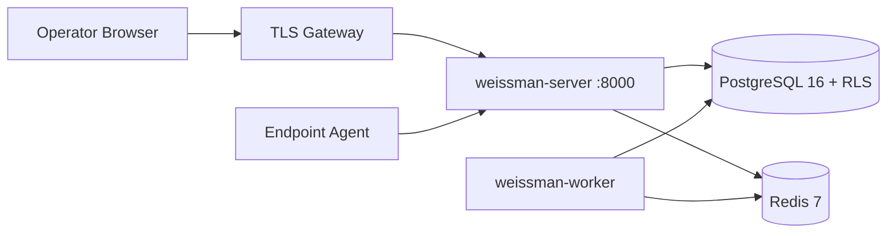

# Inspection Day Runbook — Weissman Cybersecurity

**Audience:** Sales engineer, SOC lead, CISO briefing team  
**Duration:** 60 minutes total (30 min demo + 30 min CISO deep dive)  
**Principle:** Live-only truth — every claim is backed by API responses, audit scripts, or cryptographic evidence artifacts.

---

## Canonical platform numbers (synced with code — July 2026)

| Metric | Value | Verification command |
|--------|-------|----------------------|
| Production engines | **559** | `node scripts/verify_engine_wiring.mjs` |
| Command Center routes | **112** | `node scripts/weissman-ui-audit.mjs` |
| UI pages audited | **95/95** | `node scripts/weissman-ui-audit.mjs` |
| Real probes | **300** | `node scripts/engine_reality_audit.mjs` |
| Agent-required surfaces | **45** | same |
| JWT secret minimum (production) | **48 characters** | `fingerprint_engine/src/security_startup.rs` |
| Destructive / metrics / job-bus secrets | **≥32 characters** | `PRODUCTION.env.template` |

**Pre-flight (15 minutes before guests arrive):**

```bash
bash scripts/full_audit_gate.sh
# Or if stack already running:
WEISSMAN_E2E_BASE=https://staging.example.com bash scripts/full_audit_gate.sh
```

Expected: **GLOBAL PASS**, exit code 0.

---

## Part A — 30-minute product demo (operator → buyer team)

### Minutes 0–5 — Trust & health

1. Open **`https://<host>/api/health`** — show JSON: Postgres OK, scanning enabled.
2. Login at **`/command-center/login`** via `POST /api/login` (not `/api/auth/login`).
3. Show **Command Center KPI strip** — cite live sources: `GET /api/dashboard/exec-kpis`, `GET /api/jobs`, `GET /api/findings`.
4. Optional: **`GET /api/engines/capabilities`** — 559 engines, kinds: `real_probe`, `alias`, `agent_required`.

**Talking point:** No simulated telemetry in production paths; UI evidence banners map to `routeEvidence.js`.

### Minutes 5–10 — Client & scope

1. **Clients** → create demo client with **auditor-authorized domain only**.
2. Show scope fields: domains, IP ranges, integrations (AWS/GitHub/OAST as sold).
3. Open **Billing & Usage** if subscription is in scope.

### Minutes 10–18 — Live scan → findings

1. Select client → **ENGAGE** or enqueue via API:
   ```bash
   curl -sf -X POST "https://<host>/api/command-center/scan" \
     -H "Authorization: Bearer $TOKEN" -H "Content-Type: application/json" \
     -d '{"engine":"osint","client_id":CLIENT_ID,"target":"https://example.com","depth":"1"}'
   ```
2. **Jobs** tab — job moves to `completed`.
3. **Findings & Reports** — open finding; show evidence fields (`evidence`, `verification_method`, KEV/EPSS when CVE-tagged).
4. Export **CSV** and **PDF** (`GET /api/clients/:id/report/pdf`).

### Minutes 18–24 — Differentiators

Pick two based on audience:

| Audience | Show |
|----------|------|
| Cloud | Engine group **cloud_posture** or **aws_attack** — integration chips |
| AppSec | **jwt_attack** or **graphql_attack** command center |
| OT (if sold) | One of 8 critical-infra engines + RoE banner |
| Agent (if sold) | Agent Management → online agent → host finding |

### Minutes 24–30 — Close & evidence handoff

1. Show **`GET /api/compliance/evidence-pack/:client_id`** — `weissman-compliance-evidence-pack-v2`.
2. Hand auditor **`evidence-pack/evidence-pack.json`** + PDF from `./scripts/generate_audit_evidence_pack.sh`.
3. Point to **`SECURITY_AND_COMPLIANCE.md`** + **`SIG_CAIQ_PREP_QA.md`**.

---

## Part B — 30-minute CISO deep dive (technical + governance)

### Minutes 0–8 — Architecture & isolation



- **Multi-tenant RLS:** 80+ tables, `tenant_id` + forced policies; demo `cargo test -p weissman-db --test rls_cross_tenant`.
- **Auth plane split:** `weissman_app` vs `weissman_auth` (BYPASSRLS login only).
- **Production guards:** refuse boot if JWT < 48 chars, weak secrets, `COOKIE_SECURE` off, etc.

### Minutes 8–14 — Cryptography & secrets

| Control | Implementation |
|---------|----------------|
| Passwords | bcrypt cost 12 |
| Sessions | HttpOnly refresh cookie; access JWT 15 min default |
| Webhooks | HMAC-SHA256 outbound; Paddle inbound constant-time verify |
| Job bus | `WEISSMAN_JOB_ORCHESTRATOR_SECRET` (≥32) zero-trust signing |
| TLS | 1.2+ outbound; insecure TLS blocked in production |
| Evidence pack | SHA256 of `Cargo.lock`, `package-lock.json`, SBOM |

Show **`scripts/generate_audit_evidence_pack.sh`** output and verify hashes.

### Minutes 14–20 — Engine integrity (559 engines)

Run live (or show CI logs):

```bash
node scripts/verify_engine_wiring.mjs      # 0 gaps
node scripts/engine_reality_audit.mjs      # 0 no_path
node scripts/weissman-ui-audit.mjs         # 112 routes, 95 pages
```

Explain taxonomy: **300 real_probe**, **213 alias**, **45 agent_required** — no fake findings.

### Minutes 20–26 — SDLC, CI, and audit gates

| Gate | Command |
|------|---------|
| G1 Build | `cargo build --workspace && cd frontend && npm run build` |
| G2 Tests | `cargo test --workspace && cd frontend && npm run test:coverage` |
| G3 Lint | `cargo clippy --workspace && cargo fmt --check` |
| G4 Wiring | `node scripts/verify_engine_wiring.mjs` |
| G5 Reality | `node scripts/engine_reality_audit.mjs` |
| G6 Migrations | `bash scripts/check-migration-sync.sh` |
| G7 Live + evidence | `bash scripts/full_audit_gate.sh` |

Mention: gitleaks, Trivy CRITICAL, cargo-audit, Semgrep in `.github/workflows/ci.yml`.

### Minutes 26–30 — Compliance mapping & Q&A

- **NIST CSF / SOC2 / ISO27001:** compliance evidence pack + `SECURITY_AND_COMPLIANCE.md`.
- **SIG/CAIQ:** walk **`SIG_CAIQ_PREP_QA.md`** — tenant isolation (Q3), MFA (Q8), rate limits (Q19), scope validation (Q20).
- **Not claimed without proof:** SOC2 Type II certificate, FedRAMP ATO — operator entity declares separately.
- **Open questions:** data residency region, DR RTO/RPO (`docs/operations/DISASTER-RECOVERY.md`), on-call (`INCIDENT-ONCALL-RUNBOOK-he.md`).

---

## Artifacts to leave with auditors

| Artifact | Path |
|----------|------|
| Evidence pack JSON + PDF | `evidence-pack/*/evidence-pack.{json,pdf}` |
| Compliance overview | `SECURITY_AND_COMPLIANCE.md` |
| SIG/CAIQ Q&A | `SIG_CAIQ_PREP_QA.md` |
| QA sign-off checklist | `docs/manuals/en/18-qa-verification.md` |
| Production security | `docs/manuals/en/05-production-security.md` |
| Full gate log | output of `bash scripts/full_audit_gate.sh` |

---

## Emergency fallback (if live scan slow)

1. Use pre-seeded **E2E Pipeline Client** findings (from staging QA).
2. Still demonstrate **PDF export**, **evidence-pack API**, and **full_audit_gate.sh** PASS.
3. Never substitute mock data in the UI — cite API job IDs and timestamps from prior live runs.
