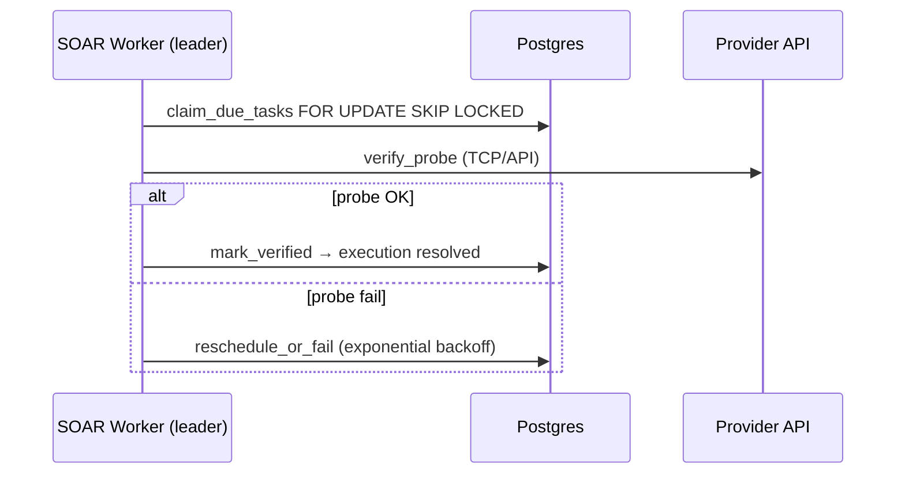

# SOAR Verification Worker — Leader Election & Metrics

The closed-loop SOAR verification worker (`fingerprint_engine/src/soar/worker.rs`) polls
`soar_verification_tasks` and confirms armored actions (isolate, PR, paging, incidents) via
provider-specific probes.

## Leader election (multi-replica)

When `REDIS_URL` is set, only **one** API replica acts as verification leader per poll window:

1. Each replica attempts `SET weissman:soar:verify:leader <replica_id> NX EX <ttl>`.
2. The holder refreshes TTL each cycle; followers skip work and increment `weissman_soar_verify_cycles_total{outcome="follower_skip"}`.
3. Without Redis (single-node / `WEISSMAN_ALLOW_SINGLE_NODE=1`), every process runs verification locally.

Set a stable identity per pod:

```bash
WEISSMAN_REPLICA_ID=weissman-api-az1-pod-3
WEISSMAN_SOAR_VERIFY_POLL_SECS=15   # default 15s; leader TTL = 2× poll interval
WEISSMAN_SOAR_VERIFY_WORKER=1      # set 0 to disable
```

## Prometheus metrics

| Metric | Type | Meaning |
|--------|------|---------|
| `weissman_soar_verify_leader` | gauge | `1` on leader replica, `0` on followers |
| `weissman_soar_verify_cycles_total{outcome}` | counter | `ok`, `error`, `follower_skip` |
| `weissman_soar_verify_tasks_total{outcome}` | counter | `verified`, `rescheduled`, `failed`, … |
| `weissman_soar_verify_last_cycle_tasks` | gauge | Tasks processed in last leader cycle |

Scrape via `GET /api/metrics` (requires `WEISSMAN_METRICS_TOKEN` in production).

## Verification flow



## Related env

| Variable | Purpose |
|----------|---------|
| `WEISSMAN_JOB_ORCHESTRATOR_SECRET` | Signed job envelopes (zero-trust dispatch) |
| `WEISSMAN_DUAL_APPROVAL_SECRET` | Second approver header for destructive SOAR/revert |
| `WEISSMAN_INTEGRATIONS_VAULT_KEY` | AES encryption for integration secrets at rest |
